# 言語

**[English](../README.md)** | **[简体中文](./README-zh-cn.md)** | **[繁體中文(港澳)](./README-zh-hk-mo.md)** | **[繁體中文(台)](./README-zh-tw.md)**

# 本プロジェクトについて

本プロジェクトは、Rust と Lua を用いて作成された、ターミナル上で遊べるクラシック軽量ゲーム集です。ターミナル内でゲームをプレイするというアイデアを実現し、多言語国際化（i18n）とクロスプラットフォームに対応しています。  
Windows、Linux、MacOS

> 最新安定版：  
> [](https://github.com/MXBraisedFish/TUI-GAME/releases/latest)

## 目次

- [実装済みゲーム](#実装済みゲーム)
- [対応言語](#対応言語)
- [対応プラットフォーム](#対応プラットフォーム)
- [その他の特徴](#その他の特徴)
- [インストールガイド](#インストールガイド)
  - [Windows](#windows)
  - [Linux](#linux)
  - [MacOS](#macos)
- [スクリーンショット](#スクリーンショット)
- [本プロジェクトを応援する](#本プロジェクトを応援する)

## 実装済みゲーム

- [2048](#2048)
- [ブラックジャック](#ブラックジャック)
- [カラーメモリーゲーム](#カラーメモリーゲーム)
- [ライツアウト](#ライツアウト)
- [迷路脱出](#迷路脱出)
- [メモリーフリップ](#メモリーフリップ)
- [マインスイーパー](#マインスイーパー)
- [パックマン](#パックマン)
- [じゃんけん](#じゃんけん)
- [エアシューター](#エアシューター)
- [スライディングパズル](#スライディングパズル)
- [スネークゲーム](#スネークゲーム)

## 対応言語

- English  
- 简体中文
- 繁體中文(港澳)
- 繁體中文(台)
- 日本語

## 対応プラットフォーム

- Windows  
- Linux
- MacOS（バグテスト未完了）  

## インストールガイド

### Windows

#### - ターミナルスクリプトによるインストール（推奨）

> すべての自動サービスを含みます（コンパイル済み、自動更新、簡単アンインストール、環境変数の自動登録）

```Shell
# フォルダ作成
mkdir tui-game

# フォルダへ移動
cd tui-game

# インストールスクリプトを取得
# 公式ソース
curl -L -o windows-tui-game-init.bat https://raw.githubusercontent.com/MXBraisedFish/TUI-GAME/main/windows-tui-game-init.bat
# ミラーソース
curl -L -o windows-tui-game-init.bat https://fastly.jsdelivr.net/gh/MXBraisedFish/TUI-GAME@main/windows-tui-game-init.bat

# インストールスクリプトを実行
windows-tui-game-init.bat
```

#### - 圧縮ファイルをダウンロード

> 一部の自動サービスを含みます（コンパイル済み、自動更新、簡単アンインストール、環境変数の自動登録なし）

```text
Releases ページへ移動:
https://github.com/MXBraisedFish/TUI-GAME/releases/latest
tui-game-windows.zip をダウンロード
tui-game-windows.zip を解凍
tg.bat を実行
```

#### - ソースコード

> ソースコード版、すべての自動サービスなし

```Shell
# フォルダ作成
mkdir tui-game
# フォルダへ移動
cd tui-game
# ソースコード取得
git clone https://github.com/MXBraisedFish/TUI-GAME.git
# デバッグ実行
cargo run
# リリースビルド
cargo build --release
```

### Linux

#### - ターミナルスクリプトによるインストール（推奨）

> すべての自動サービスを含みます（コンパイル済み、自動更新、簡単アンインストール、環境変数の自動登録）

```Shell
# フォルダ作成
mkdir tui-game

# フォルダへ移動
cd tui-game

# インストールスクリプトを取得
# 公式ソース
curl -L -o linux-tui-game-init.sh https://raw.githubusercontent.com/MXBraisedFish/TUI-GAME/main/linux-tui-game-init.sh
# ミラーソース
curl -L -o linux-tui-game-init.sh https://fastly.jsdelivr.net/gh/MXBraisedFish/TUI-GAME@main/linux-tui-game-init.sh

# インストールスクリプトを実行
sh linux-tui-game-init.sh
```

#### - 圧縮ファイルをダウンロード

> 一部の自動サービスを含みます（コンパイル済み、自動更新、簡単アンインストール、環境変数の自動登録なし）

```text
Releases ページへ移動:
https://github.com/MXBraisedFish/TUI-GAME/releases/latest
tui-game-linux.tar.gz をダウンロード
tui-game-linux.tar.gz を解凍
tui-game.sh を実行
```

#### - ソースコード

> ソースコード版、すべての自動サービスなし

```Shell
# フォルダ作成
mkdir tui-game
# フォルダへ移動
cd tui-game
# ソースコード取得
git clone https://github.com/MXBraisedFish/TUI-GAME.git
# デバッグ実行
cargo run
# リリースビルド
cargo build --release
```

### MacOS（バグテスト未完了）  

#### - ターミナルスクリプトによるインストール（推奨）

> すべての自動サービスを含みます（コンパイル済み、自動更新、簡単アンインストール、環境変数の自動登録）

```Shell
# フォルダ作成
mkdir tui-game

# フォルダへ移動
cd tui-game

# インストールスクリプトを取得
# 公式ソース
curl -L -o macos-tui-game-init.sh https://raw.githubusercontent.com/MXBraisedFish/TUI-GAME/main/macos-tui-game-init.sh
# ミラーソース
curl -L -o macos-tui-game-init.sh https://fastly.jsdelivr.net/gh/MXBraisedFish/TUI-GAME@main/macos-tui-game-init.sh

# インストールスクリプトを実行
sh macos-tui-game-init.sh
```

#### - コンパイル済み版をダウンロード

> 簡単アンインストールなし、自動更新なし

```text
Releases ページへ移動:
https://github.com/MXBraisedFish/TUI-GAME/releases/latest
tui-game-macos.zip をダウンロード
tui-game-macos.zip を解凍
tui-game.sh を実行
```

#### - ソースコード

> ソースコード版、すべての自動サービスなし

```Shell
# フォルダ作成
mkdir tui-game
# フォルダへ移動
cd tui-game
# ソースコード取得
git clone https://github.com/MXBraisedFish/TUI-GAME.git
# デバッグ実行
cargo run
# リリースビルド
cargo build --release
```

## スクリーンショット

### ホームとゲーム一覧

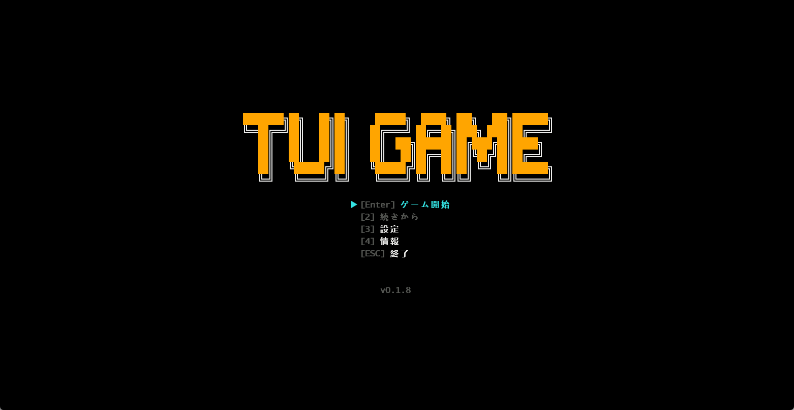
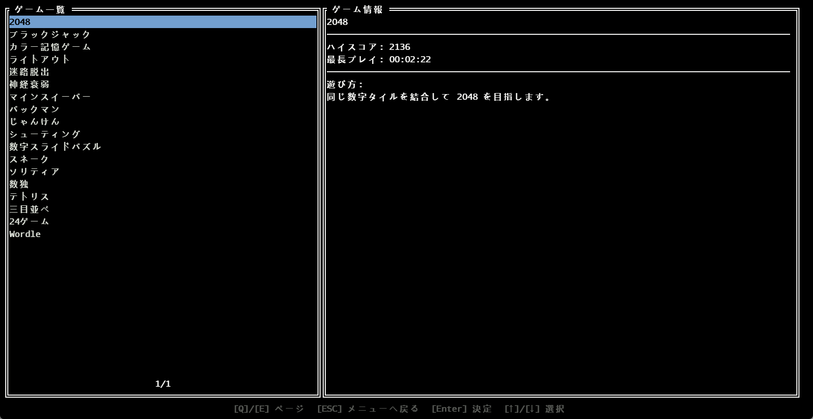

### 2048

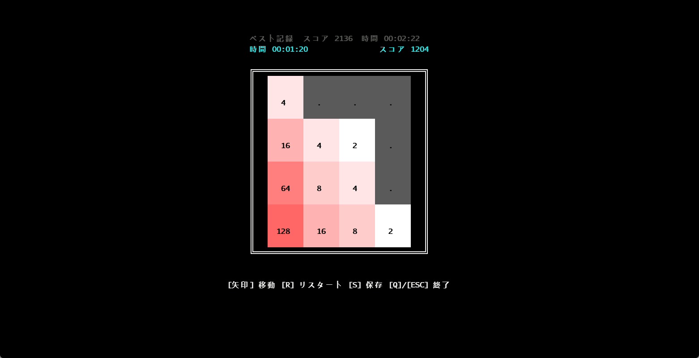

### ブラックジャック

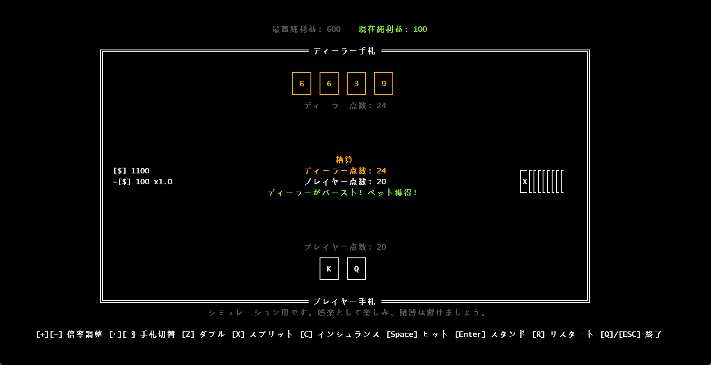

### カラーメモリーゲーム

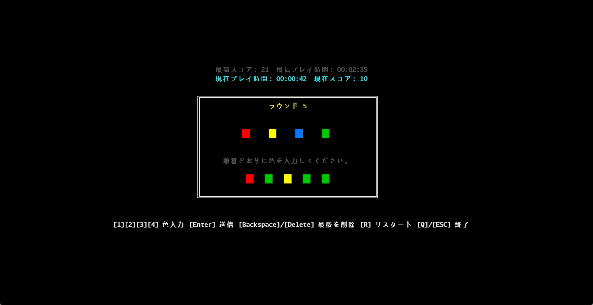

### ライツアウト

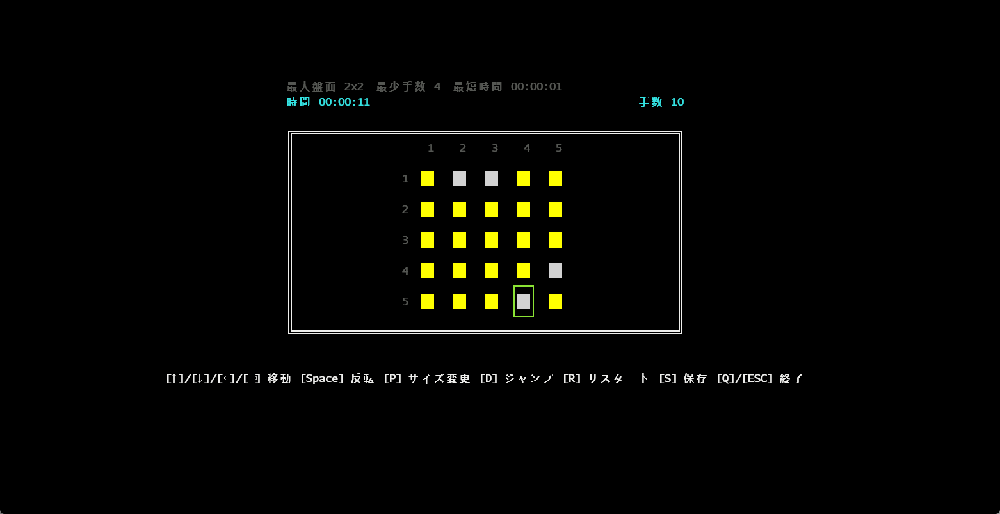

### 迷路脱出

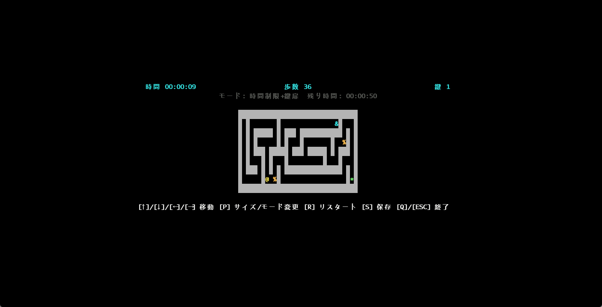

### メモリーフリップ

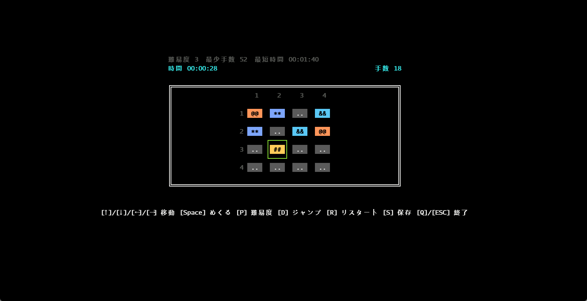

### マインスイーパー

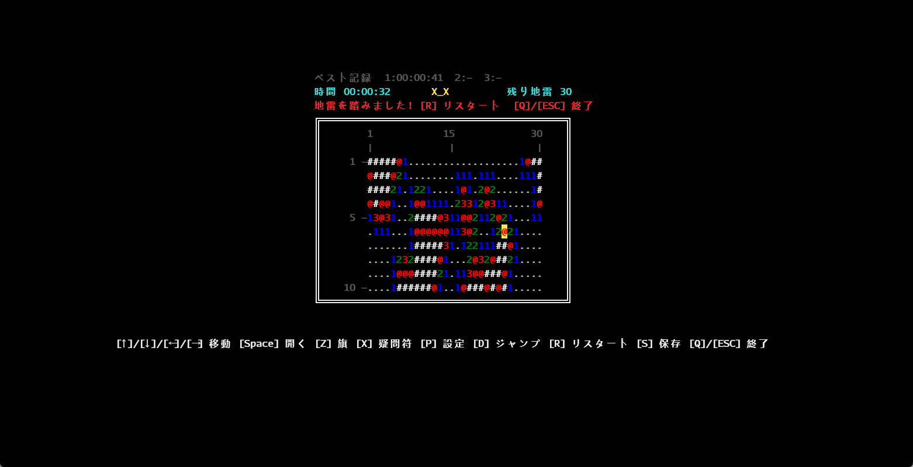

### パックマン
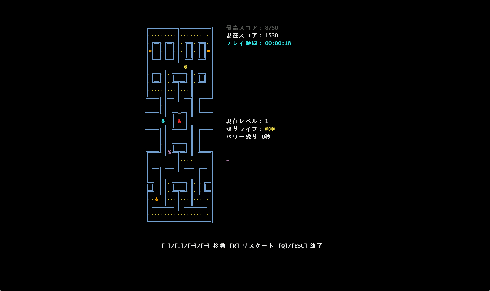

### じゃんけん

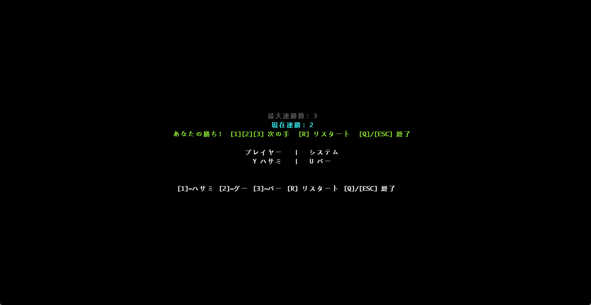

### エアシューター

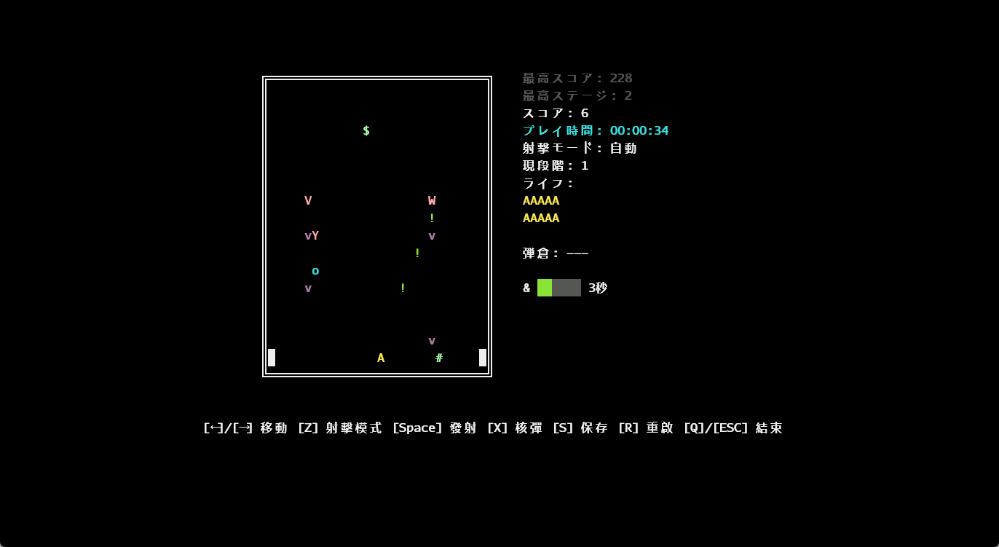

### スライディングパズル

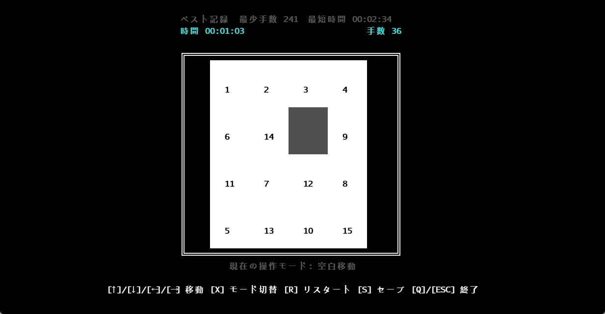

### スネークゲーム

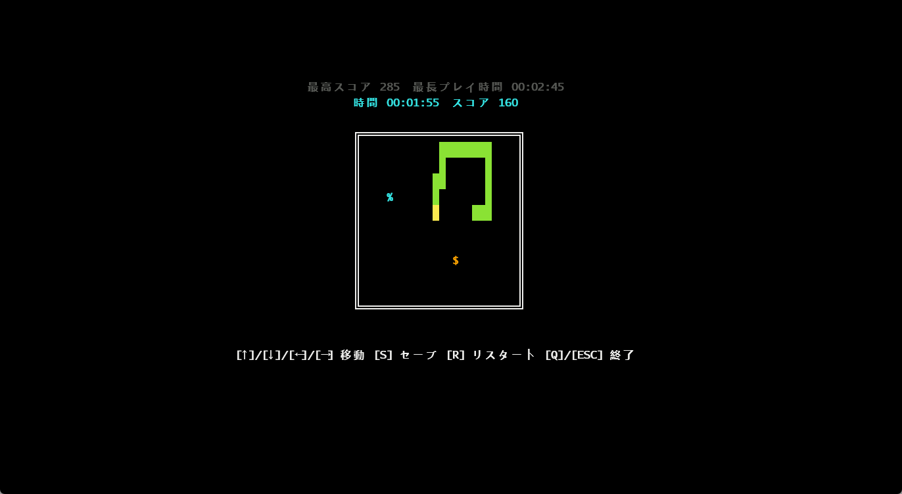

## 本プロジェクトを応援する

このプロジェクトを気に入っていただけたら、ぜひリポジトリにスター⭐をお願いします！継続的な更新の励みになります。
より良いアイデアや提案があれば、Issue の作成を歓迎します。

MacOS 版は対応する実機がないため十分にテストできていません。バグを発見した場合は、ぜひご報告ください。ありがとうございます！

GitHub Repo: [MXBraisedFish/TUI-GAME](https://github.com/MXBraisedFish/TUI-GAME)
