# 语言

**[English](../README.md)**

# 本项目是

本项目基于 Rust 和 Lua 所制作的可在终端游玩的经典轻量级游戏合集，实现了在终端中游玩游戏的想法，支持国际化多语言和跨平台。
Windows，Linux，MacOS

> 最新正式版：  
> [](https://github.com/MXBraisedFish/TUI-GAME/releases/latest)

## 目录

- [实现的游戏](#实现的游戏)
- [语言支持](#语言支持)
- [平台支持](#平台支持)
- [其他特性](#其他特性)
- [安装指南](#安装指南)
  - [Windows](#Windows)
  - [Linux](#Linux)
  - [MacOS](#MacOS)
- [界面截图](#界面截图)
- [支持本项目](#支持本项目)

## 实现的游戏

- [2048](#2048)
- [二十一点](#二十一点)
- [颜色记忆游戏](#颜色记忆游戏)
- [点灯游戏](#点灯游戏)
- [走迷宫](#走迷宫)
- [记忆翻牌](#记忆翻牌)
- [扫雷](#扫雷)
- [吃豆人](#吃豆人)
- [石头剪刀布](#石头剪刀布)
- [空中射击](#空中射击)
- [数字华容道](#数字华容道)
- [贪吃蛇](#贪吃蛇)
- [纸牌接龙](#纸牌接龙)
- [数独](#数独)
- [俄罗斯方块](#俄罗斯方块)
- [井字棋](#井字棋)

## 语言支持

- English  
- 简体中文

## 平台支持

- Windows
- Linux
- MacOS (仍需测试 bug)

## 安装指南

### Windows

#### - 终端脚本安装(推荐)

> 包含所有自动服务(已编译，自动更新，快捷卸载，自动注册环境变量)

```Shell
# 新建文件夹
mkdir tui-game

# 进入文件夹
cd tui-game

# 拉取安装脚本
# 官方源
curl -L -o windows-tui-game-init.bat https://raw.githubusercontent.com/MXBraisedFish/TUI-GAME/main/windows-tui-game-init.bat
# 镜像源
curl -L -o windows-tui-game-init.bat https://fastly.jsdelivr.net/gh/MXBraisedFish/TUI-GAME@main/windows-tui-game-init.bat

# 运行安装脚本
windows-tui-game-init.bat
```

#### - 下载压缩包

> 包含部分自动服务(已编译，自动更新，快捷卸载，无自动注册环境变量)

```text
进入Releases界面:
https://github.com/MXBraisedFish/TUI-GAME/releases/latest
下载压缩包 tui-game-windows.zip
解压 tui-game-windows.zip
运行 tg.bat 脚本
```

#### - 源代码

> 源代码版本，无任何自动服务

```Shell
# 新建文件夹
mkdir tui-game
# 进入文件夹
cd tui-game
# 拉取源代码
git clone https://github.com/MXBraisedFish/TUI-GAME.git
# 运行调试
cargo run
# 构建编译
cargo build --release
```

### Linux

#### - 终端脚本安装(推荐)

> 包含所有自动服务(已编译，自动更新，快捷卸载，自动注册环境变量)

```Shell
# 新建文件夹
mkdir tui-game

# 进入文件夹
cd tui-game

# 拉取安装脚本
# 官方源
curl -L -o linux-tui-game-init.sh https://raw.githubusercontent.com/MXBraisedFish/TUI-GAME/main/linux-tui-game-init.sh
# 镜像源
curl -L -o linux-tui-game-init.sh https://fastly.jsdelivr.net/gh/MXBraisedFish/TUI-GAME@main/linux-tui-game-init.sh

# 运行安装脚本
sh linux-tui-game-init.sh
```

#### - 下载压缩包

> 包含部分自动服务(已编译，自动更新，快捷卸载，无自动注册环境变量)

```text
进入Releases界面:
https://github.com/MXBraisedFish/TUI-GAME/releases/latest
下载压缩包 tui-game-linux.tar.gz
解压 tui-game-linux.tar.gz
运行 tui-game.sh 脚本
```

#### - 源代码

> 源代码版本，无任何自动服务

```Shell
# 新建文件夹
mkdir tui-game
# 进入文件夹
cd tui-game
# 拉取源代码
git clone https://github.com/MXBraisedFish/TUI-GAME.git
# 运行调试
cargo run
# 构建编译
cargo build --release
```

### MacOS (仍需测试 bug)

#### - 终端脚本安装(推荐)

> 包含所有自动服务(已编译，自动更新，快捷卸载，自动注册环境变量)

```Shell
# 新建文件夹
mkdir tui-game

# 进入文件夹
cd tui-game

# 拉取安装脚本
# 官方源
curl -L -o macos-tui-game-init.sh https://raw.githubusercontent.com/MXBraisedFish/TUI-GAME/main/macos-tui-game-init.sh
# 镜像源
curl -L -o macos-tui-game-init.sh https://fastly.jsdelivr.net/gh/MXBraisedFish/TUI-GAME@main/macos-tui-game-init.sh

# 运行安装脚本
sh macos-tui-game-init.sh
```

#### - 下载编译版本

> 无快捷卸载程序，无自动更新程序

```text
进入Releases界面:
https://github.com/MXBraisedFish/TUI-GAME/releases/latest
下载压缩包 tui-game-macos.zip
解压 tui-game-macos.zip
运行 tui-game.sh 脚本
```

#### - 源代码

> 源代码版本，无任何自动服务

```Shell
# 新建文件夹
mkdir tui-game
# 进入文件夹
cd tui-game
# 拉取源代码
git clone https://github.com/MXBraisedFish/TUI-GAME.git
# 运行调试
cargo run
# 构建编译
cargo build --release
```

## 界面截图

### 主页和游戏列表

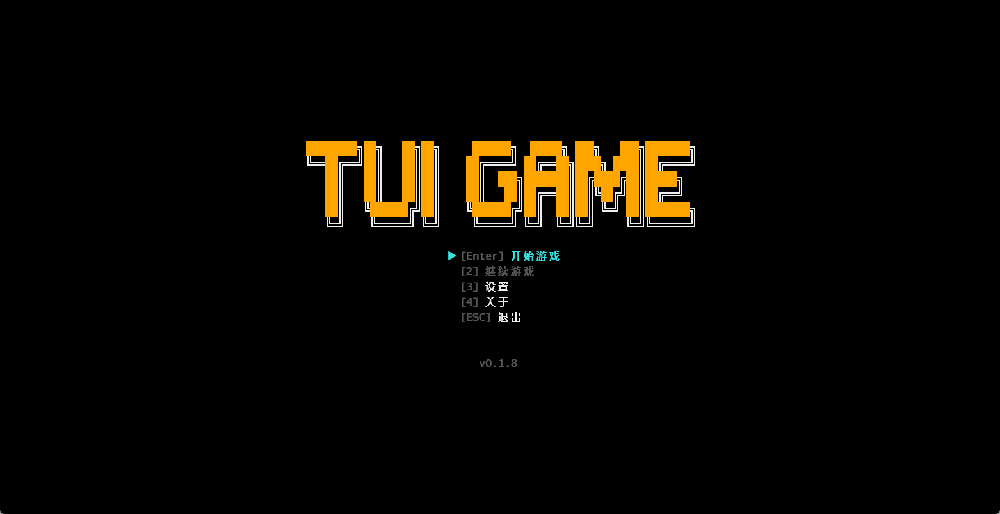
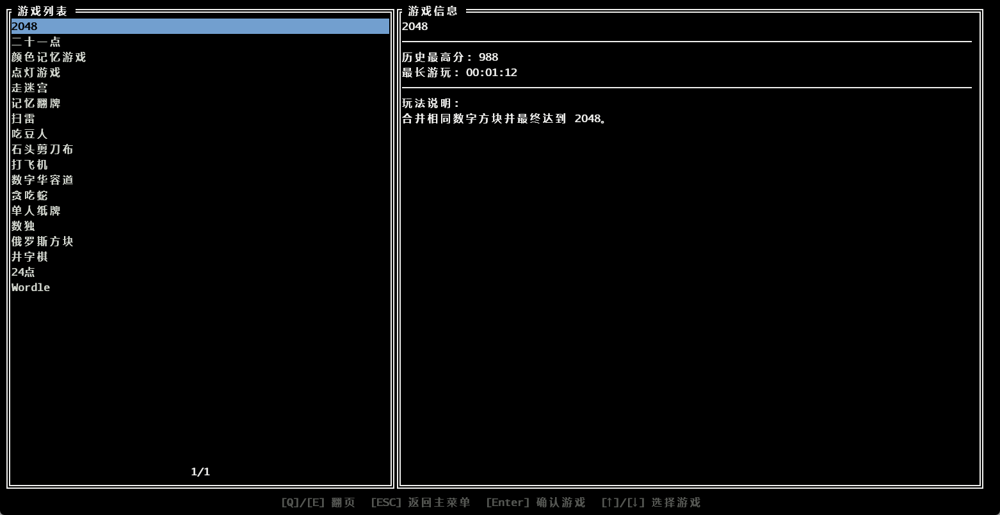

### 2048

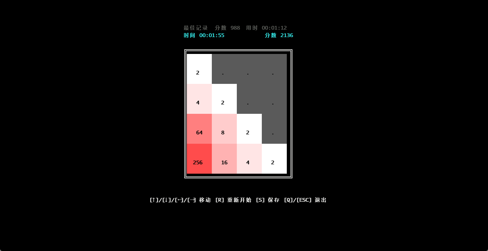

### 二十一点

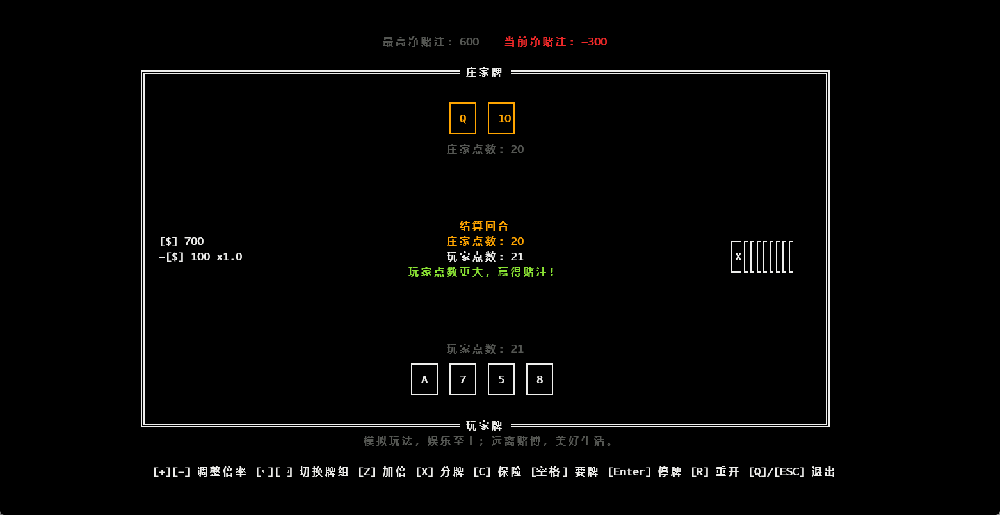

### 颜色记忆游戏

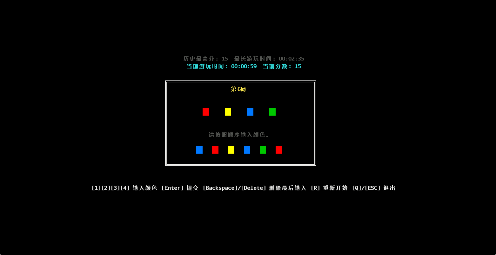

### 点灯游戏

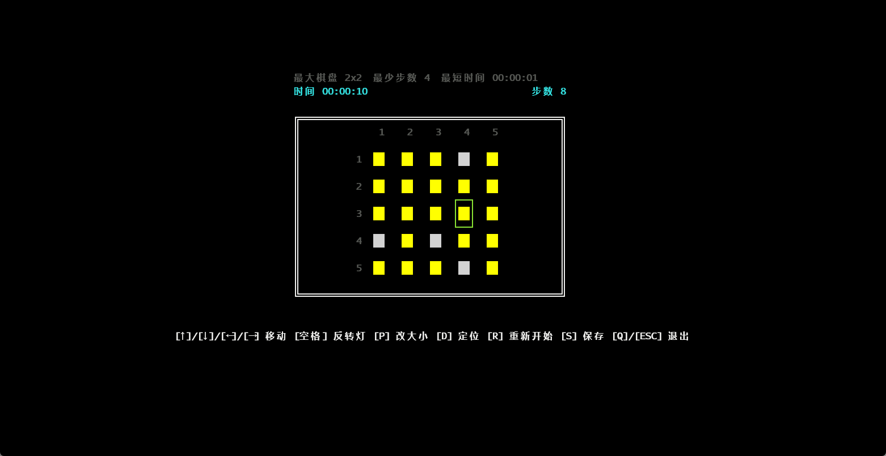

### 走迷宫

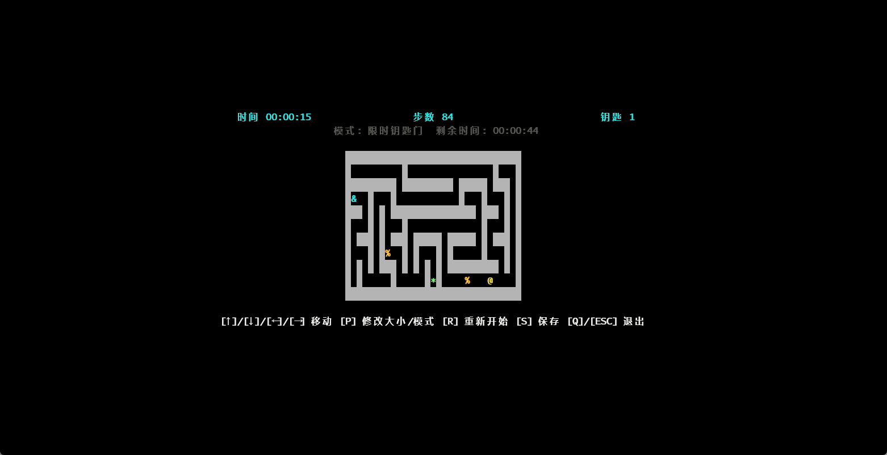

### 记忆翻牌

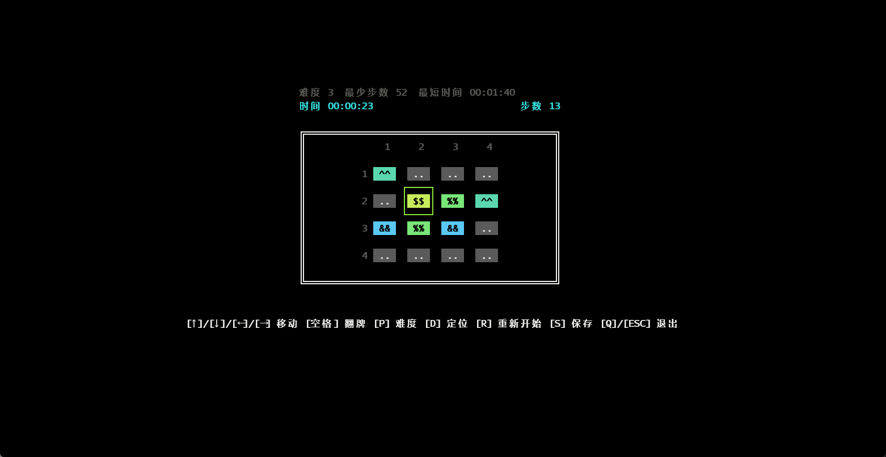

### 扫雷

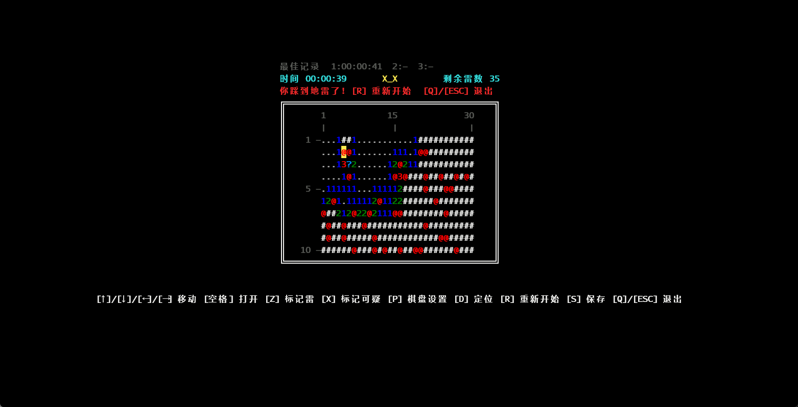

### 吃豆人
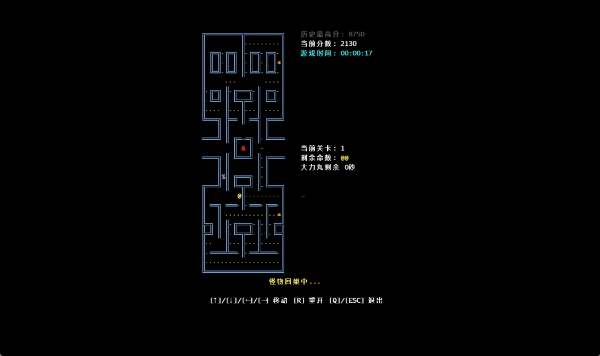

### 石头剪刀布

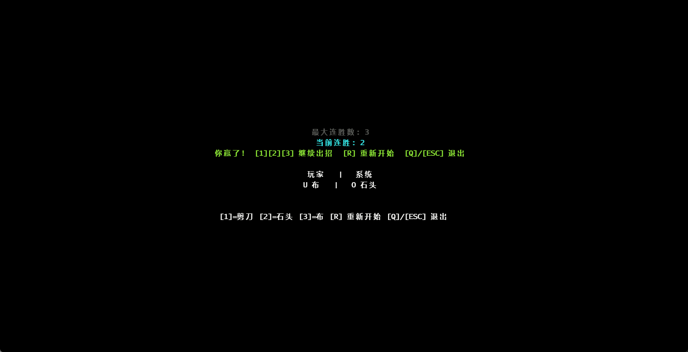

### 空中射击

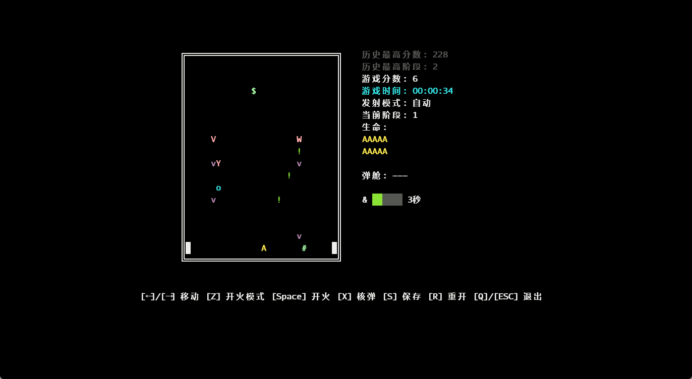

### 数字华容道

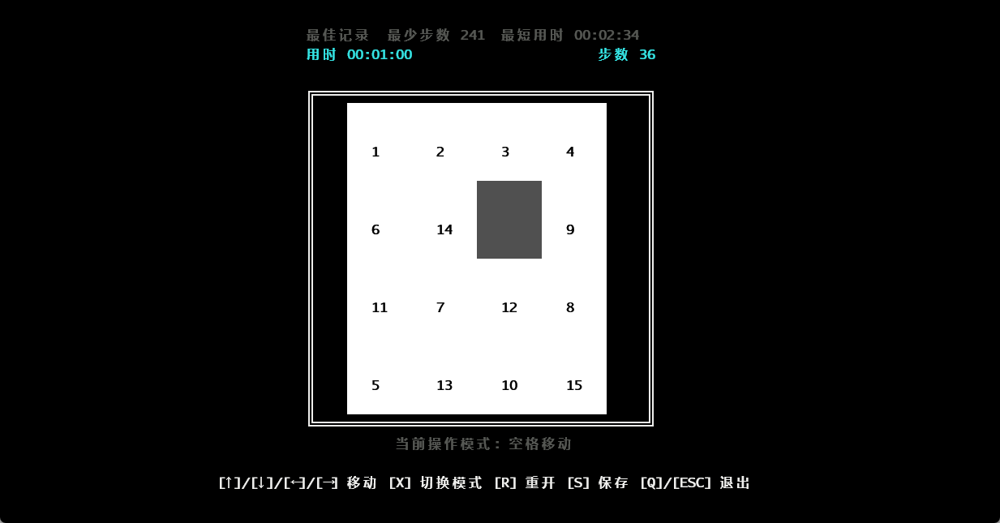

### 贪吃蛇

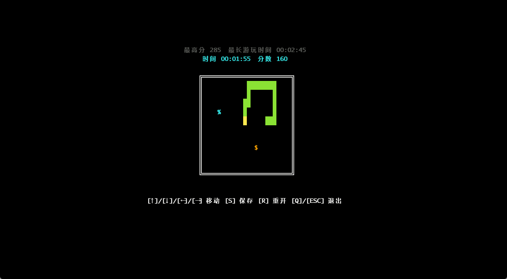

### 纸牌接龙

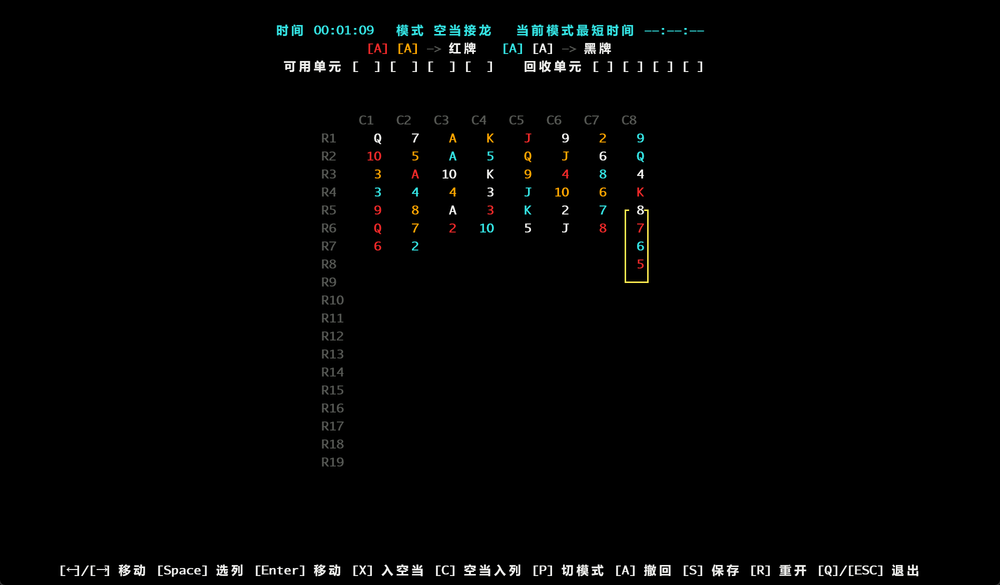

### 数独

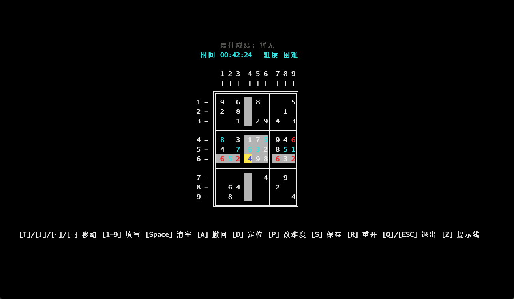

### 俄罗斯方块


### 井字棋

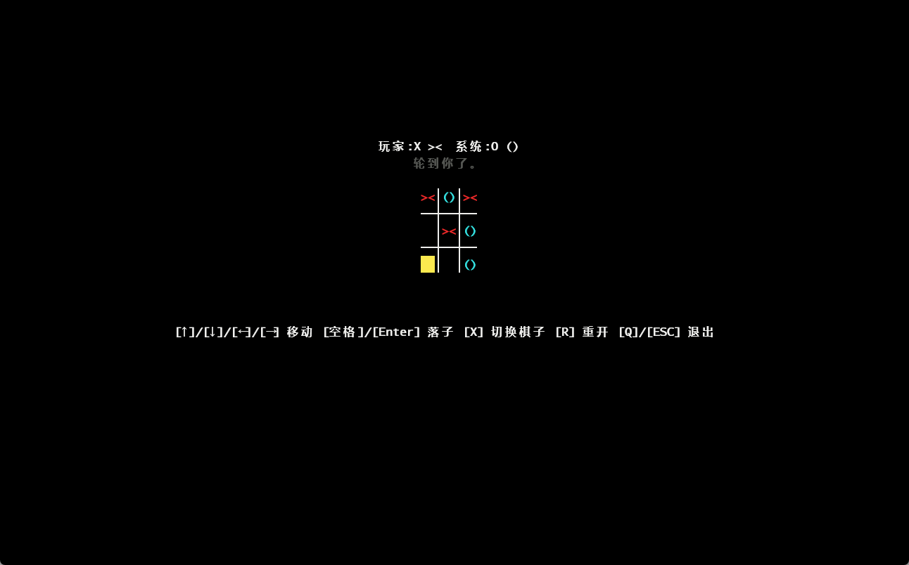

## 支持本项目

如果您喜欢这个项目，请为我的仓库点一颗星星⭐！这也是我持续更新的动力。如果您有更好的想法或建议，欢迎提出 Issue。

MacOS版本未经过测试，我没有相关的系统设备，如果您发现有Bug请及时反馈，十分感谢！

GitHub Repo: [MXBraisedFish/TUI-GAME](https://github.com/MXBraisedFish/TUI-GAME)
