# 語言

**[English](../README.md)** | **[简体中文](./README-zh-cn.md)** | **[繁體中文(港澳)](./README-zh-hk-mo.md)**  | **[日本語](./README-ja-jp.md)**

# 本專案是

本專案基於 Rust 和 Lua 所製作可在終端遊玩的經典輕量級遊戲合集，實現了在終端中遊玩遊戲的想法，支援國際化多語言和跨平台。
Windows，Linux，MacOS

> 最新正式版：  
> [](https://github.com/MXBraisedFish/TUI-GAME/releases/latest)

## 目錄

- [實現的遊戲](#實現的遊戲)
- [語言支援](#語言支援)
- [平台支援](#平台支援)
- [其他特性](#其他特性)
- [安裝指南](#安裝指南)
  - [Windows](#Windows)
  - [Linux](#Linux)
  - [MacOS](#MacOS)
- [介面截圖](#介面截圖)
- [支援本專案](#支援本專案)

## 實現的遊戲

- [2048](#2048)
- [二十一點](#二十一點)
- [顏色記憶遊戲](#顏色記憶遊戲)
- [點燈遊戲](#點燈遊戲)
- [走迷宮](#走迷宮)
- [記憶翻牌](#記憶翻牌)
- [踩地雷](#踩地雷)
- [小精靈](#小精靈)
- [石頭剪刀布](#石頭剪刀布)
- [空中射擊](#空中射擊)
- [數字華容道](#數字華容道)
- [貪食蛇](#貪食蛇)
- [紙牌接龍](#紙牌接龍)
- [數獨](#數獨)
- [俄羅斯方塊](#俄羅斯方塊)
- [圈圈叉叉](#圈圈叉叉)

## 語言支援

- English  
- 简体中文
- 繁體中文(港澳)
- 繁體中文(台)
- 日本語

## 平台支援

- Windows
- Linux
- MacOS (仍需測試 bug)

## 安裝指南

### Windows

#### - 終端機腳本安裝(推薦)

> 包含所有自動服務(已編譯，自動更新，快速卸載，自動註冊環境變數)

```Shell
# 新增資料夾
mkdir tui-game

# 進入資料夾
cd tui-game

# 拉取安裝腳本
# 官方源
curl -L -o windows-tui-game-init.bat https://raw.githubusercontent.com/MXBraisedFish/TUI-GAME/main/windows-tui-game-init.bat
# 鏡像源
curl -L -o windows-tui-game-init.bat https://fastly.jsdelivr.net/gh/MXBraisedFish/TUI-GAME@main/windows-tui-game-init.bat

# 執行安裝腳本
windows-tui-game-init.bat
```

#### - 下載壓縮包

> 包含部分自動服務(已編譯，自動更新，快速卸載，無自動註冊環境變數)

```text
進入Releases介面:
https://github.com/MXBraisedFish/TUI-GAME/releases/latest
下載壓縮包 tui-game-windows.zip
解壓縮 tui-game-windows.zip
執行 tg.bat 腳本
```

#### - 原始碼

> 原始碼版本，無任何自動服務

```Shell
# 新增資料夾
mkdir tui-game
# 進入資料夾
cd tui-game
# 拉取原始碼
git clone https://github.com/MXBraisedFish/TUI-GAME.git
# 執行偵錯
cargo run
# 建置編譯
cargo build --release
```

### Linux

#### - 終端機腳本安裝(推薦)

> 包含所有自動服務(已編譯，自動更新，快速卸載，自動註冊環境變數)

```Shell
# 新增資料夾
mkdir tui-game

# 進入資料夾
cd tui-game

# 拉取安裝腳本
# 官方源
curl -L -o linux-tui-game-init.sh https://raw.githubusercontent.com/MXBraisedFish/TUI-GAME/main/linux-tui-game-init.sh
# 鏡像源
curl -L -o linux-tui-game-init.sh https://fastly.jsdelivr.net/gh/MXBraisedFish/TUI-GAME@main/linux-tui-game-init.sh

# 執行安裝腳本
sh linux-tui-game-init.sh
```

#### - 下載壓縮包

> 包含部分自動服務(已編譯，自動更新，快速卸載，無自動註冊環境變數)

```text
進入Releases介面:
https://github.com/MXBraisedFish/TUI-GAME/releases/latest
下載壓縮包 tui-game-linux.tar.gz
解壓縮 tui-game-linux.tar.gz
執行 tui-game.sh 腳本
```

#### - 原始碼

> 原始碼版本，無任何自動服務

```Shell
# 新增資料夾
mkdir tui-game
# 進入資料夾
cd tui-game
# 拉取原始碼
git clone https://github.com/MXBraisedFish/TUI-GAME.git
# 執行偵錯
cargo run
# 建置編譯
cargo build --release
```

### MacOS (仍需測試 bug)

#### - 終端機腳本安裝(推薦)

> 包含所有自動服務(已編譯，自動更新，快速卸載，自動註冊環境變數)

```Shell
# 新增資料夾
mkdir tui-game

# 進入資料夾
cd tui-game

# 拉取安裝腳本
# 官方源
curl -L -o macos-tui-game-init.sh https://raw.githubusercontent.com/MXBraisedFish/TUI-GAME/main/macos-tui-game-init.sh
# 鏡像源
curl -L -o macos-tui-game-init.sh https://fastly.jsdelivr.net/gh/MXBraisedFish/TUI-GAME@main/macos-tui-game-init.sh

# 執行安裝腳本
sh macos-tui-game-init.sh
```

#### - 下載編譯版本

> 無快速卸載程式，無自動更新程式

```text
進入Releases介面:
https://github.com/MXBraisedFish/TUI-GAME/releases/latest
下載壓縮包 tui-game-macos.zip
解壓縮 tui-game-macos.zip
執行 tui-game.sh 腳本
```

#### - 原始碼

> 原始碼版本，無任何自動服務

```Shell
# 新增資料夾
mkdir tui-game
# 進入資料夾
cd tui-game
# 拉取原始碼
git clone https://github.com/MXBraisedFish/TUI-GAME.git
# 執行偵錯
cargo run
# 建置編譯
cargo build --release
```

## 介面截圖

### 主頁和遊戲列表

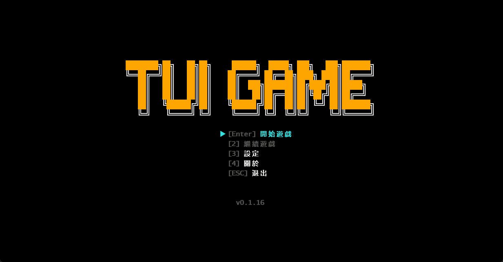


### 2048

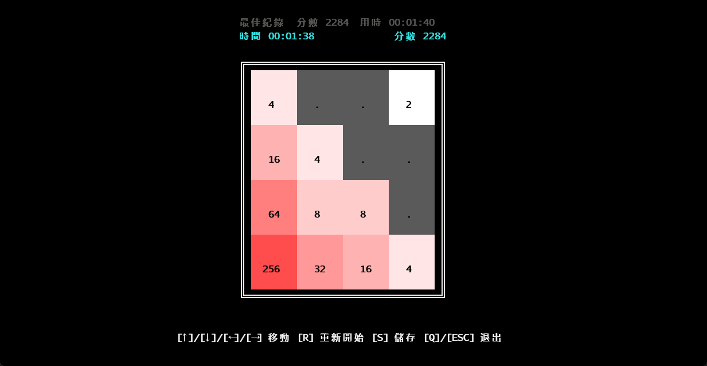

### 二十一點

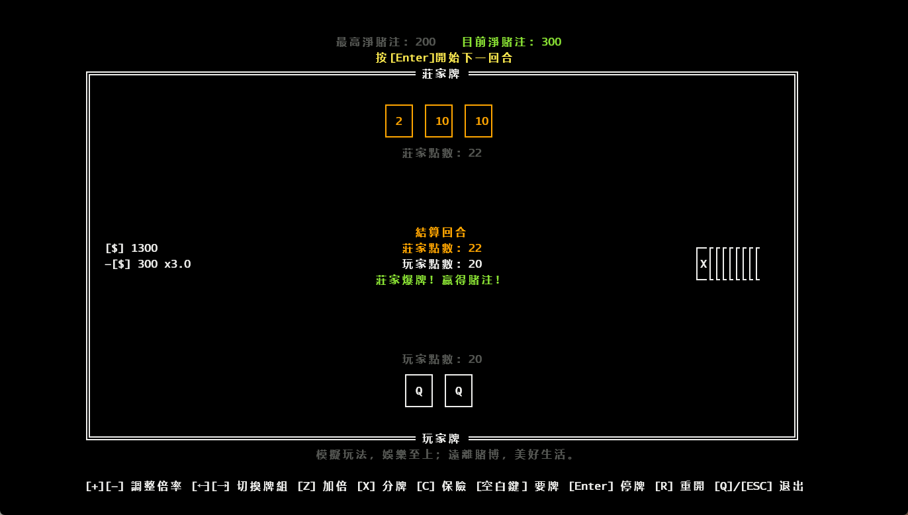

### 顏色記憶遊戲

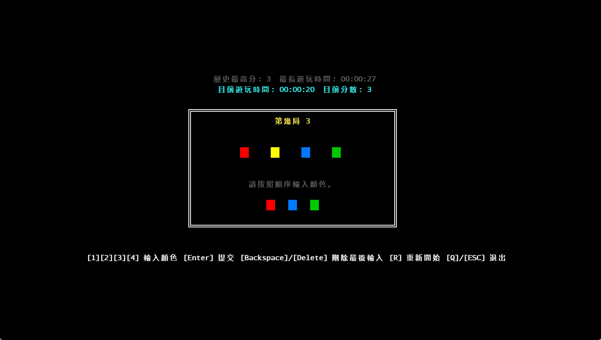

### 點燈遊戲

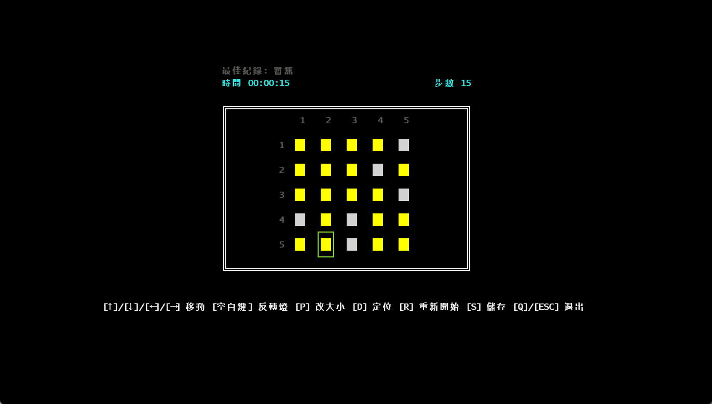

### 走迷宮

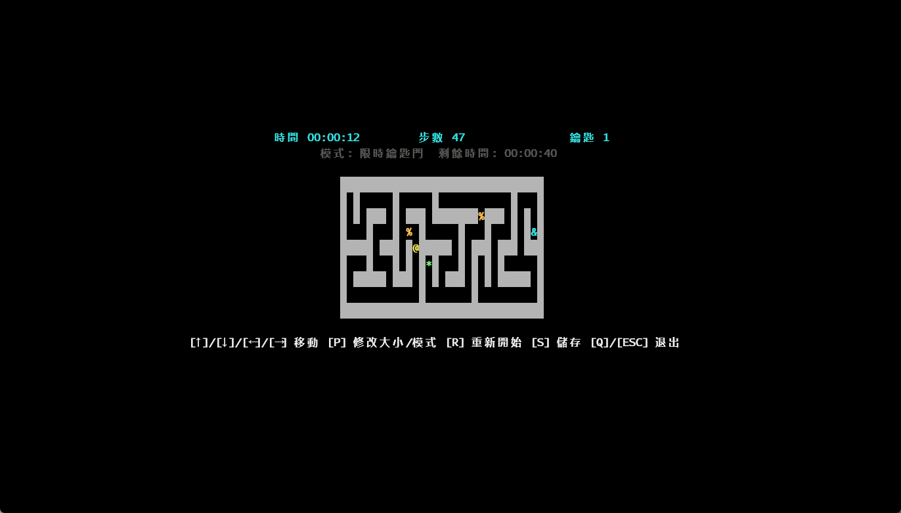

### 記憶翻牌

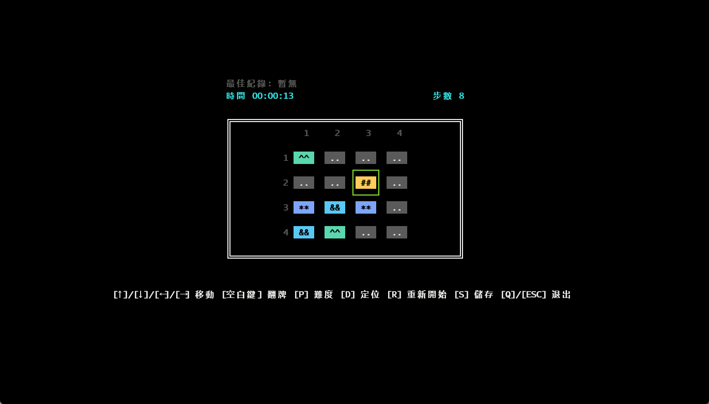

### 踩地雷

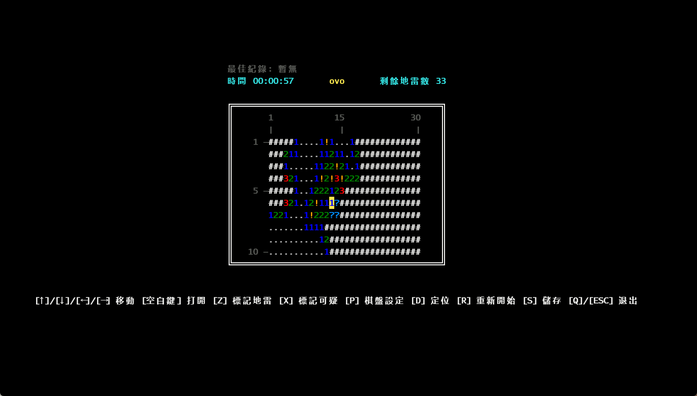

### 小精靈
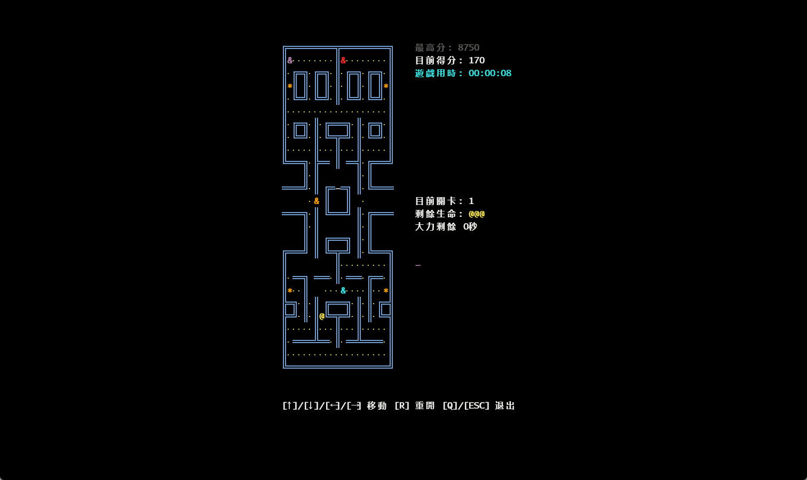

### 石頭剪刀布

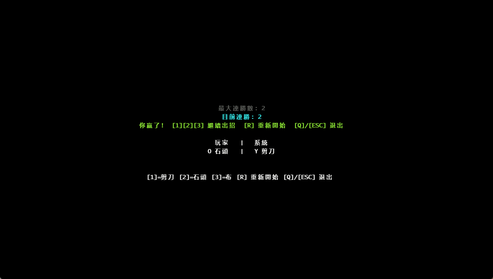

### 空中射擊

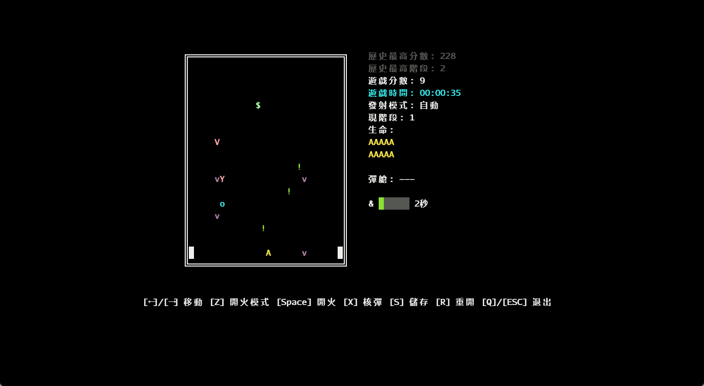

### 數字華容道

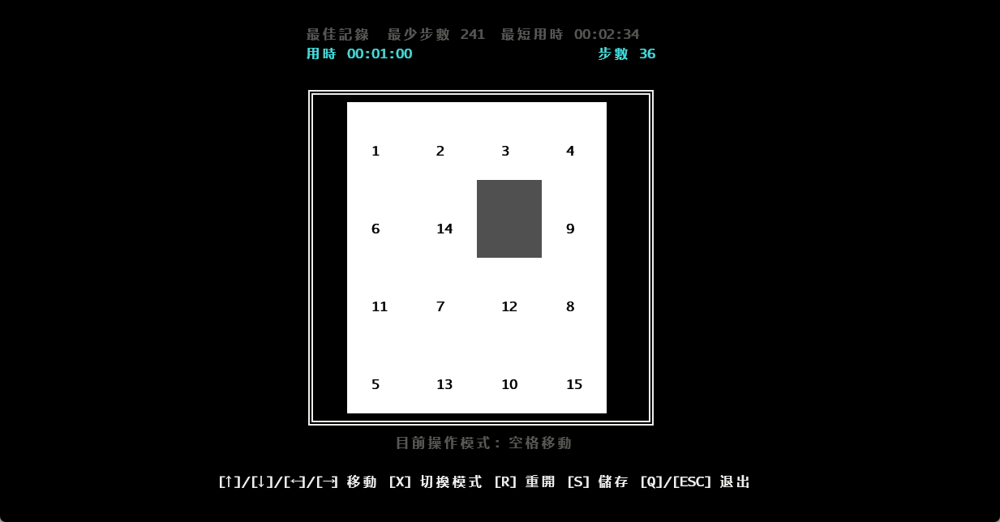

### 貪食蛇

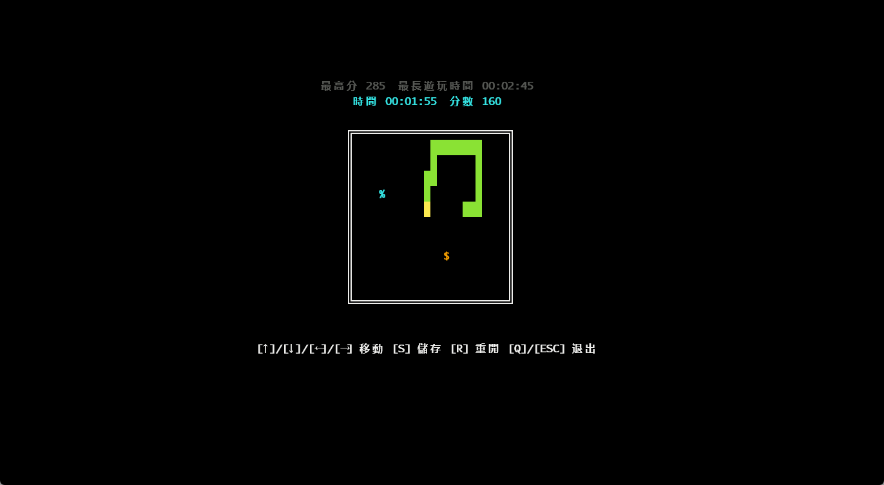

### 紙牌接龍

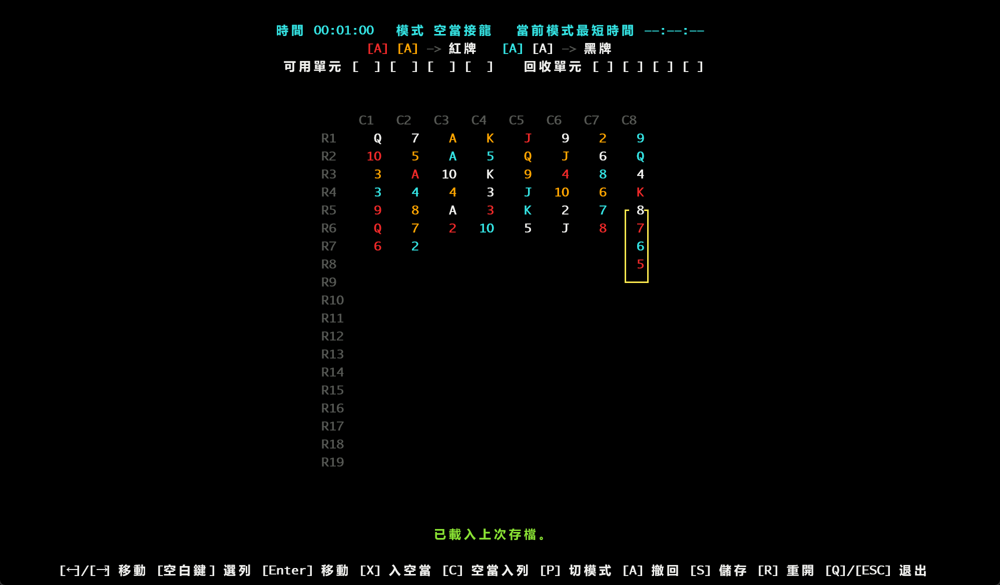

### 數獨

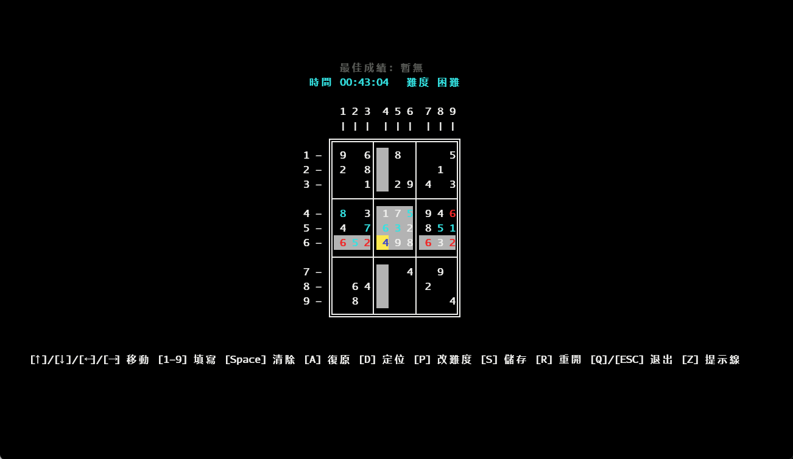

### 俄羅斯方塊

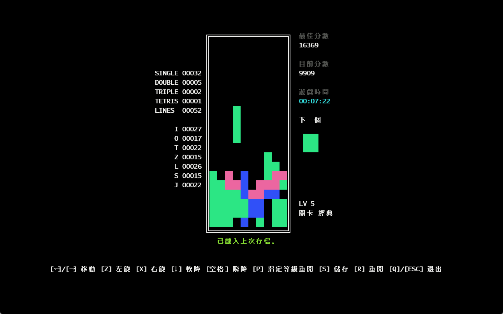

### 圈圈叉叉

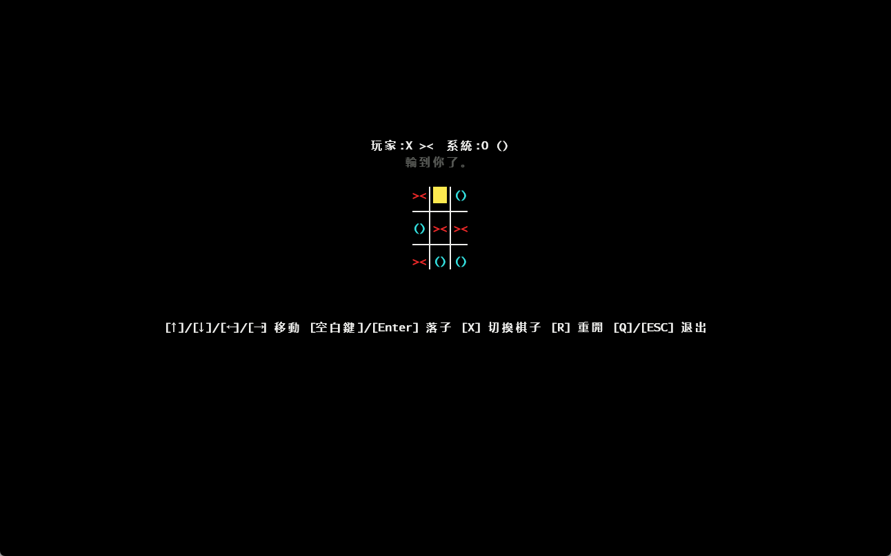

## 支援本專案

如果您喜歡這個專案，請為我的倉庫點一顆星星⭐！這也是我持續更新的動力。如果您有更好的想法或建議，歡迎提出 Issue。

MacOS版本未經過測試，我沒有相關的系統設備，如果您發現有Bug請及時回饋，十分感謝！

GitHub Repo: [MXBraisedFish/TUI-GAME](https://github.com/MXBraisedFish/TUI-GAME)