# Language

**[简体中文](./README-i18n/README-zh-cn.md)** | **[繁體中文(港澳)](./README-i18n/README-zh-hk-mo.md)** | **[繁體中文(台)](./README-i18n/README-zh-tw.md)** | **[日本語](./README-i18n/README-ja-jp.md)**

# About This Project

This project is a classic lightweight game collection built with Rust and Lua, designed to be played directly in the terminal. It supports internationalization (i18n) with multiple languages and is cross-platform compatible.  
Windows, Linux, MacOS

> Latest stable release:  
> [](https://github.com/MXBraisedFish/TUI-GAME/releases/latest)

## Table of Contents

- [Implemented Games](#implemented-games)
- [Language Support](#language-support)
- [Platform Support](#platform-support)
- [Other Features](#other-features)
- [Installation Guide](#installation-guide)
  - [Windows](#windows)
  - [Linux](#linux)
  - [MacOS](#macos)
- [Screenshots](#screenshots)
- [Support This Project](#support-this-project)

## Implemented Games

- [2048](#2048)
- [Blackjack](#blackjack)
- [Color Memory](#color-memory)
- [Lights Out](#lights-out)
- [Maze Escape](#maze-escape)
- [Memory Flip](#memory-flip)
- [Minesweeper](#minesweeper)
- [Pac-Man](#pac-man)
- [Rock Paper Scissors](#rock-paper-scissors)
- [Air Shooter](#air-shooter)
- [Number Sliding Puzzle](#number-sliding-puzzle)
- [Snake](#snake)
- [Solitaire](#solitaire)
- [Sudoku](#sudoku)
- [Tetris](#tetris)

## Language Support

- English  
- 简体中文
- 繁體中文(港澳)
- 繁體中文(台)
- 日本語

## Platform Support

- Windows  
- Linux
- MacOS (still needs bug testing)  

## Installation Guide

### Windows

#### - Terminal Script Installation (Recommended)

> Includes full automation services (precompiled, auto update, quick uninstall, automatic environment variable registration)

```Shell
# Create folder
mkdir tui-game

# Enter folder
cd tui-game

# Download install script
# Official source
curl -L -o windows-tui-game-init.bat https://raw.githubusercontent.com/MXBraisedFish/TUI-GAME/main/windows-tui-game-init.bat
# Mirror source
curl -L -o windows-tui-game-init.bat https://fastly.jsdelivr.net/gh/MXBraisedFish/TUI-GAME@main/windows-tui-game-init.bat

# Run install script
windows-tui-game-init.bat
```

#### - Download Archive

> Includes partial automation services (precompiled, auto update, quick uninstall, no automatic environment variable registration)

```text
Go to the Releases page:
https://github.com/MXBraisedFish/TUI-GAME/releases/latest
Download tui-game-windows.zip
Extract tui-game-windows.zip
Run tg.bat
```

#### - Source Code

> Source version, no automation services

```Shell
# Create folder
mkdir tui-game
# Enter folder
cd tui-game
# Clone source code
git clone https://github.com/MXBraisedFish/TUI-GAME.git
# Run debug
cargo run
# Build release
cargo build --release
```

### Linux 

#### - Terminal Script Installation (Recommended)

> Includes full automation services (precompiled, auto update, quick uninstall, automatic environment variable registration)

```Shell
# Create folder
mkdir tui-game

# Enter folder
cd tui-game

# Download install script
# Official source
curl -L -o linux-tui-game-init.sh https://raw.githubusercontent.com/MXBraisedFish/TUI-GAME/main/linux-tui-game-init.sh
# Mirror source
curl -L -o linux-tui-game-init.sh https://fastly.jsdelivr.net/gh/MXBraisedFish/TUI-GAME@main/linux-tui-game-init.sh

# Run install script
sh linux-tui-game-init.sh
```

#### - Download Archive

> Includes partial automation services (precompiled, auto update, quick uninstall, no automatic environment variable registration)

```text
Go to the Releases page:
https://github.com/MXBraisedFish/TUI-GAME/releases/latest
Download tui-game-linux.tar.gz
Extract tui-game-linux.tar.gz
Run tui-game.sh
```

#### - Source Code

> Source version, no automation services

```Shell
# Create folder
mkdir tui-game
# Enter folder
cd tui-game
# Clone source code
git clone https://github.com/MXBraisedFish/TUI-GAME.git
# Run debug
cargo run
# Build release
cargo build --release
```

### MacOS (still needs bug testing)  

#### - Terminal Script Installation (Recommended)

> Includes full automation services (precompiled, auto update, quick uninstall, automatic environment variable registration)

```Shell
# Create folder
mkdir tui-game

# Enter folder
cd tui-game

# Download install script
# Official source
curl -L -o macos-tui-game-init.sh https://raw.githubusercontent.com/MXBraisedFish/TUI-GAME/main/macos-tui-game-init.sh
# Mirror source
curl -L -o macos-tui-game-init.sh https://fastly.jsdelivr.net/gh/MXBraisedFish/TUI-GAME@main/macos-tui-game-init.sh

# Run install script
sh macos-tui-game-init.sh
```

#### - Download Compiled Version

> No quick uninstall, no auto update

```text
Go to the Releases page:
https://github.com/MXBraisedFish/TUI-GAME/releases/latest
Download tui-game-macos.zip
Extract tui-game-macos.zip
Run tui-game.sh
```

#### - Source Code

> Source version, no automation services

```Shell
# Create folder
mkdir tui-game
# Enter folder
cd tui-game
# Clone source code
git clone https://github.com/MXBraisedFish/TUI-GAME.git
# Run debug
cargo run
# Build release
cargo build --release
```

## Screenshots

### Home and Game List

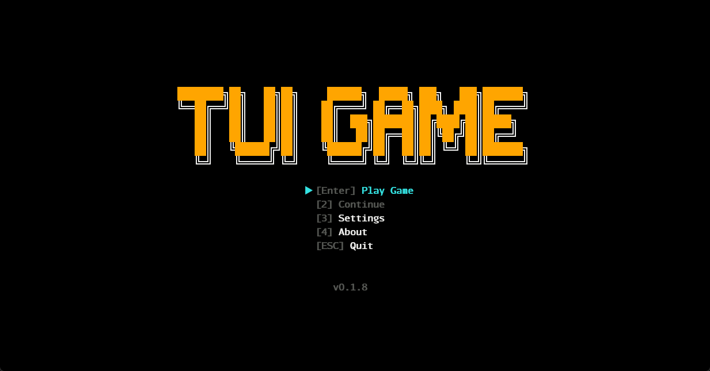
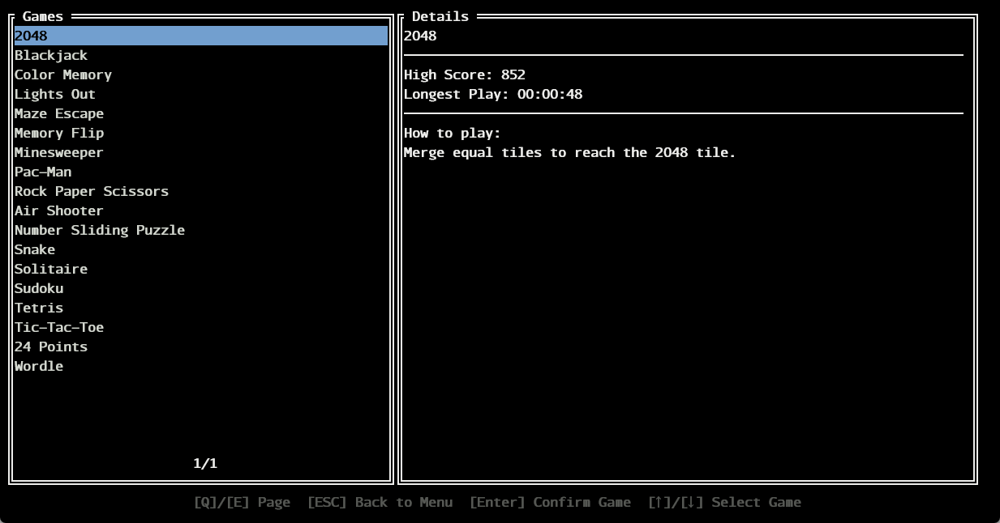

### 2048

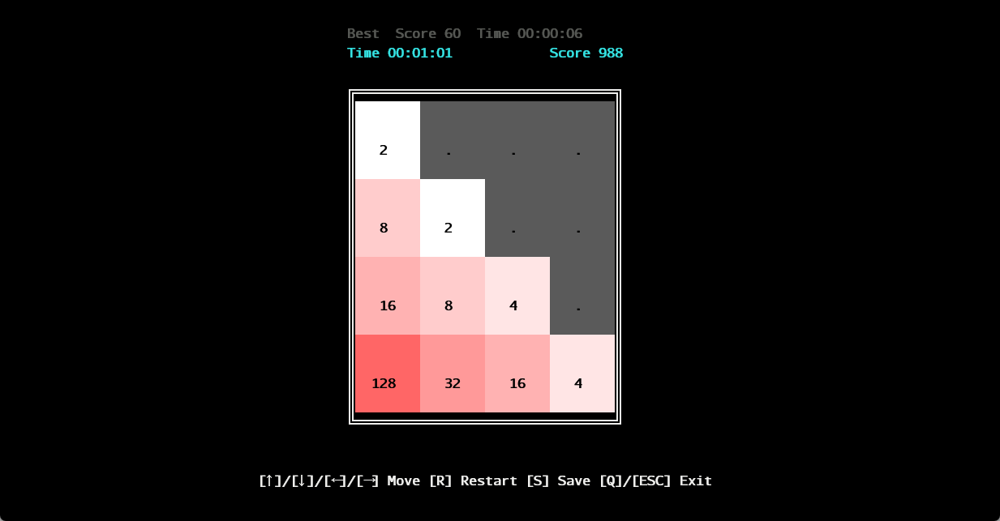

### Blackjack

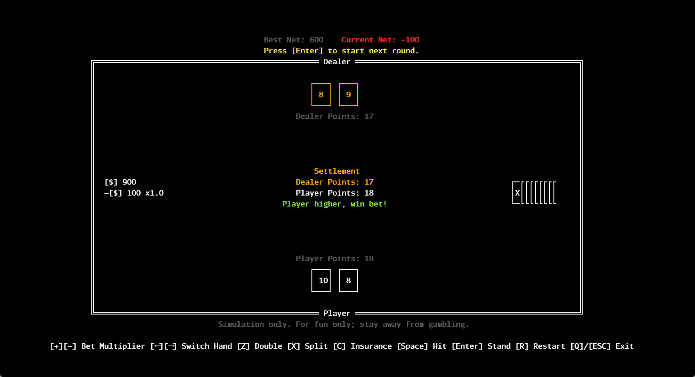

### Color Memory

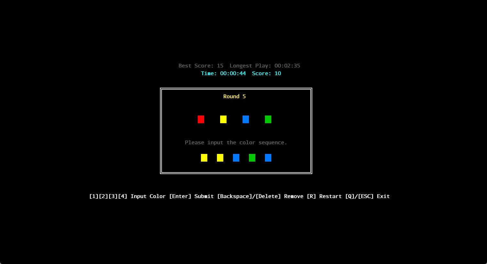

### Lights Out

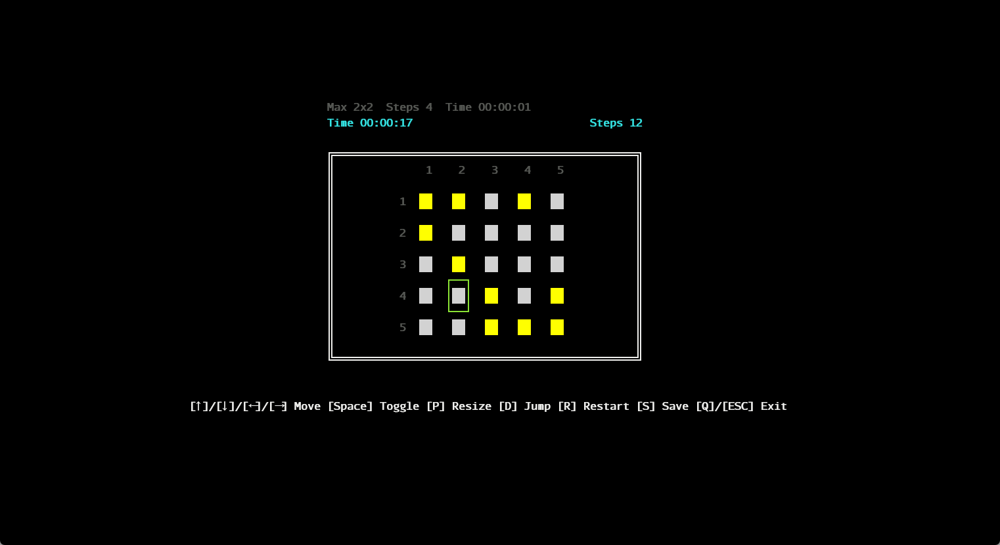

### Maze Escape

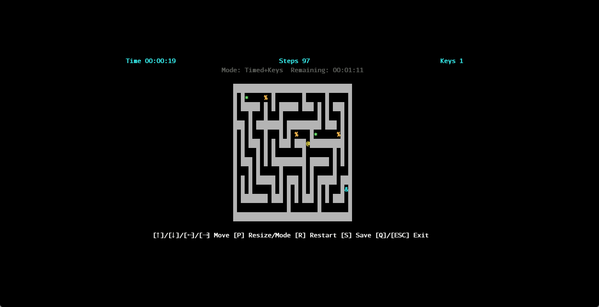

### Memory Flip

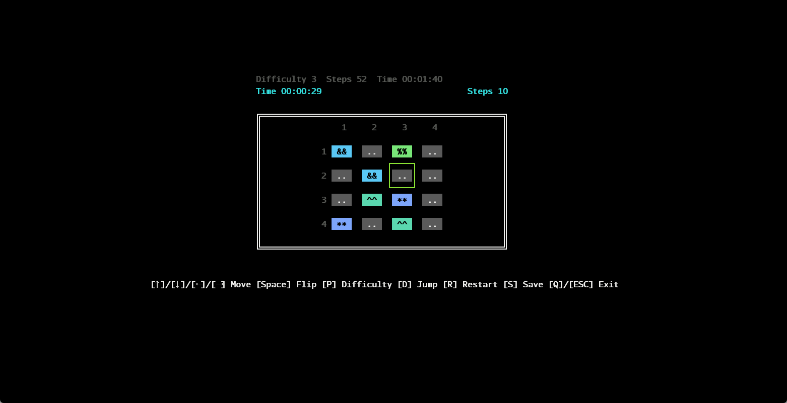

### Minesweeper

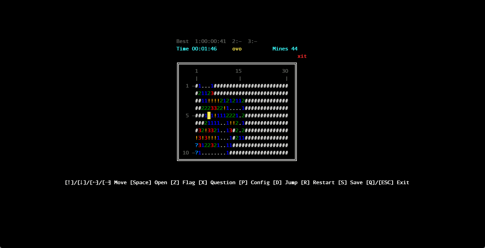

### Pac-Man
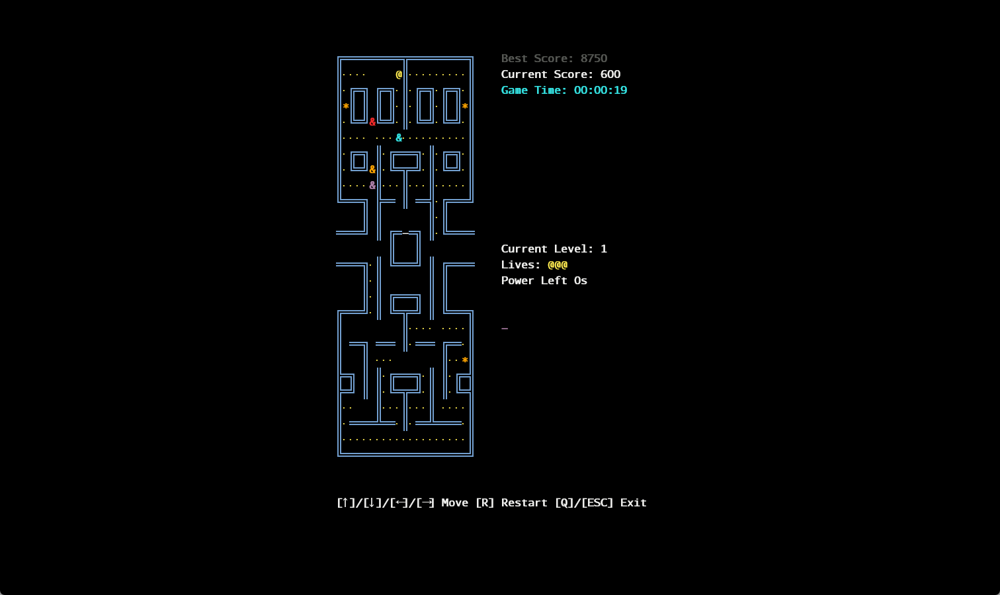

### Rock Paper Scissors

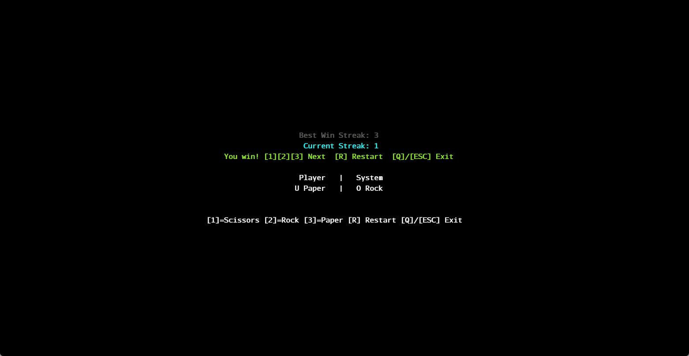

### Air Shooter

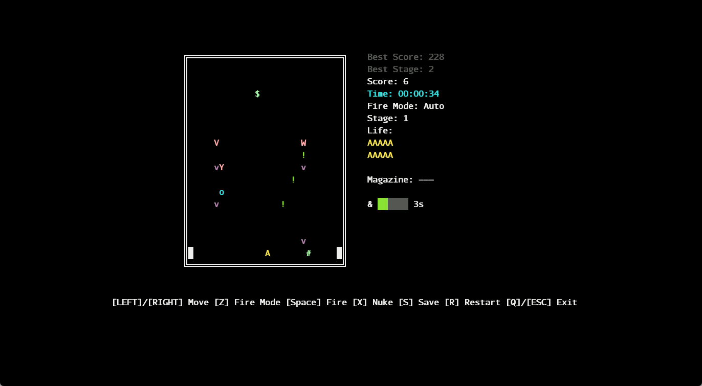

### Number Sliding Puzzle

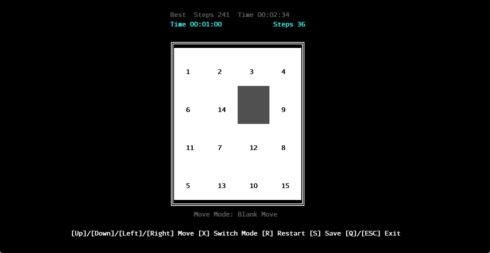

### Snake

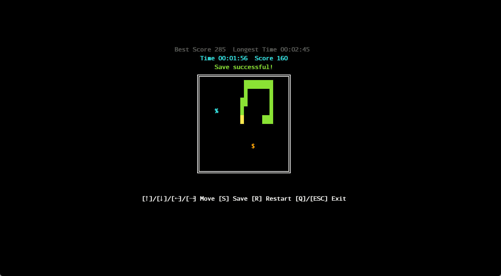

### Solitaire


### Sudoku

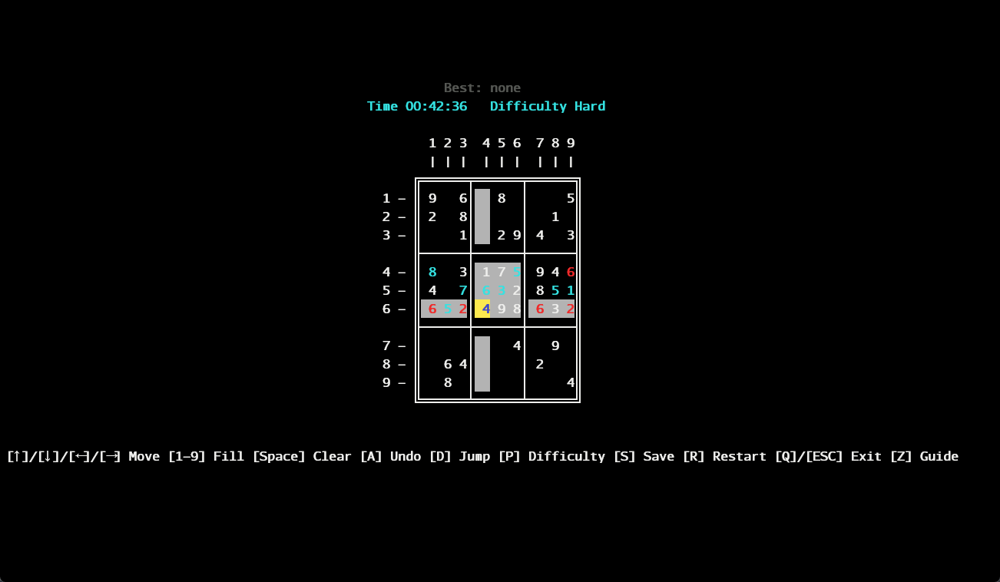

### Tetris

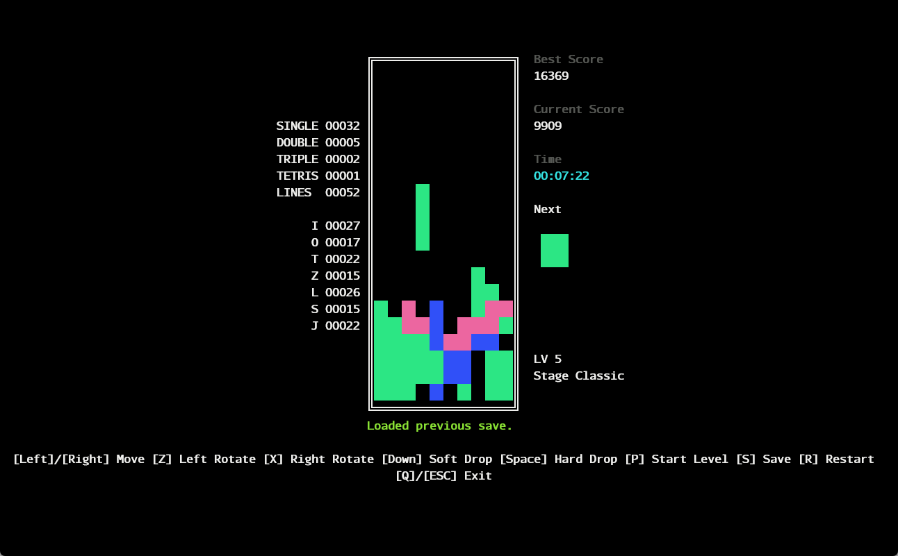

## Support This Project

If you like this project, please consider giving the repository a star⭐! It motivates me to keep updating.
If you have better ideas or suggestions, feel free to open an Issue.

TheMacOS versions have not been fully tested due to lack of corresponding devices. If you encounter any bugs, please report them. Thank you very much!

GitHub Repo: [MXBraisedFish/TUI-GAME](https://github.com/MXBraisedFish/TUI-GAME)

