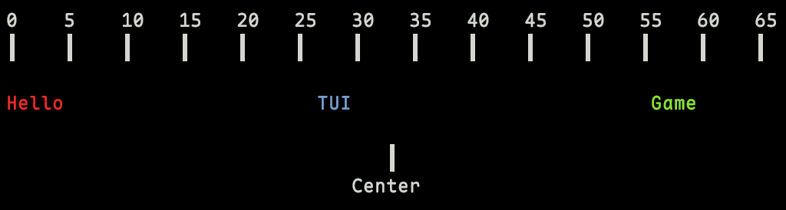
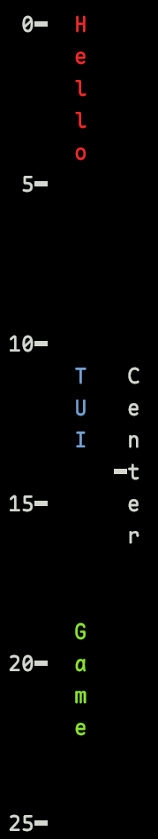
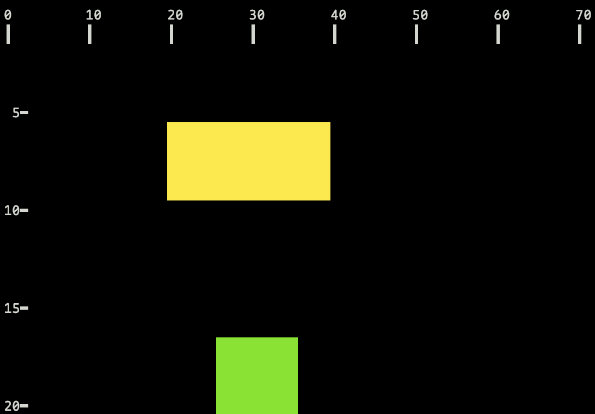

# align 库

## 基本库说明

`align` 根据当前画布尺寸和相对位置计算对齐坐标。

## 目录

### 常量

| 常量名 | 说明 |
| ------ | ---- |
| `align.AUTO` | 自动对齐（水平/垂直居中） |
| `align.LEFT` | 左对齐 |
| `align.HORIZONTAL_CENTER` | 水平居中 |
| `align.RIGHT` | 右对齐 |
| `align.TOP` | 顶部对齐 |
| `align.VERTICAL_CENTER` | 垂直居中 |
| `align.BOTTOM` | 底部对齐 |
| `align.CENTER` | 双向居中 |

### 方法

| 方法名                       | 说明        |
| ------------------------- | --------- |
| `align.resolve_x{...}`    | 计算水平坐标    |
| `align.resolve_y{...}`    | 计算垂直坐标    |
| `align.resolve_rect{...}` | 计算矩形左上角坐标 |

## 常量

## `AUTO`

自动对齐模式。

**可用于**

- 参数 `horizontal_align`
- 参数 `vertical_align`

### 调用

```lua
align.AUTO
```

### 额外补充

- `align` API 中用于水平对齐时等价于 `align.HORIZONTAL_CENTER`。
- `align` API 中用于垂直对齐时等价于 `align.VERTICAL_CENTER`。
- `draw` 和 `measurement` API 中用于垂直对齐时等价于 `align.LEFT`。

---

## `HORIZONTAL_CENTER`

水平居中模式。

**可用于**

- 参数 `horizontal_align`

### 调用

```lua
align.HORIZONTAL_CENTER
```

---

## `RIGHT`

右对齐模式。

**可用于**

- 参数 `horizontal_align`

### 调用

```lua
align.RIGHT
```

---

## `TOP`

顶部对齐模式。

**可用于**

- 参数 `vertical_align`

### 调用

```lua
align.TOP
```

---

## `VERTICAL_CENTER`

垂直居中模式。

**可用于**

- 参数 `vertical_align`

### 调用

```lua
align.VERTICAL_CENTER
```

---

## `BOTTOM`

底部对齐模式。

**可用于**

- 参数 `vertical_align`

### 调用

```lua
align.BOTTOM
```

---

## `CENTER`

双向居中模式。

**可用于**

- 参数 `horizontal_align`
- 参数 `vertical_align`

### 调用

```lua
align.CENTER
```

### 额外补充

- 水平对齐时等价于 `align.HORIZONTAL_CENTER`。
- 垂直对齐时等价于 `align.VERTICAL_CENTER`。

---

## 方法

## `resolve_x`

根据元素宽度与水平对齐方式，计算元素左边缘的 x 坐标。

### 调用

```lua
-- 表参数
align.resolve_x{}
```

### 参数

| 参数名                | 类型          | 必填  | 默认值      | 说明       |
| ------------------ | ----------- | --- | -------- | -------- |
| `width`            | integer     | 是   | -        | 文本宽度     |
| `horizontal_align` | const-align | 是   | -        | 水平对齐方式   |
| `offset_x`         | integer     | 否   | `0`      | 锚点上的水平偏移 |
| `relative_x`       | integer     | 否   | `nil`    | 自定义水平锚点  |
| `slice_layer`      | string      | 否   | `"base"` | 目标切片图层   |

### 返回

| 返回值名 | 类型 | 说明 |
| --- | --- | --- |
| `x` | integer | 解析后的水平坐标 |
### 示例

```lua
x1 = align.resolve_x { width = 5, horizontal_align = align.LEFT }
draw.text { x = x1, y = 4, text = "Hello", fg = color.BRIGHT_RED }

x2 = align.resolve_x { width = 3, horizontal_align = align.CENTER, offset_x = -5 }
draw.text { x = x2, y = 4, text = "TUI", fg = color.BRIGHT_BLUE }

x3 = align.resolve_x { width = 4, horizontal_align = align.RIGHT, relative_x = 60 }
draw.text { x = x3, y = 4, text = "Game", fg = color.BRIGHT_GREEN }
```

输出：



---

## `resolve_y`

根据元素高度与垂直对齐方式，计算元素上边缘的 y 坐标。

### 调用

```lua
-- 表参数
align.resolve_y{}
```

### 参数

| 参数名              | 类型      | 必填  | 默认值      | 说明       |
| ---------------- | ------- | --- | -------- | -------- |
| `height`         | integer | 是   | -        | 文本高度     |
| `vertical_align` | const   | 是   | -        | 垂直对齐方式   |
| `offset_y`       | integer | 否   | `0`      | 锚点上的垂直偏移 |
| `relative_y`     | integer | 否   | `nil`    | 自定义垂直锚点  |
| `slice_layer`    | string  | 否   | `"base"` | 目标切片图层   |

### 返回

| 返回值名 | 类型 | 说明 |
| --- | --- | --- |
| `y` | integer | 解析后的垂直坐标 |

### 示例

```lua
y1 = align.resolve_y { height = 5, vertical_align = align.TOP }
draw.text { x = 5, y = y1, text = "Hello", fg = color.BRIGHT_RED, max_width = 1 }

y2 = align.resolve_y { height = 3, vertical_align = align.CENTER, offset_y = -2 }
draw.text { x = 5, y = y2, text = "TUI", fg = color.BRIGHT_BLUE, max_width = 1 }

y3 = align.resolve_y { height = 4, vertical_align = align.BOTTOM, relative_y = 23 }
draw.text { x = 5, y = y3, text = "Game", fg = color.BRIGHT_GREEN, max_width = 1 }
```

输出：



---

### `resolve_rect`

- **方法作用**：同时计算矩形左上角坐标，一次得到 `x, y`。
- **方法要求**：无
- **方法参数**：

| 参数名 | 类型 | 必填 | 默认值 | 说明 | 额外补充 |
| ------ | ---- | ---- | ------ | ---- | -------- |
| `width` | integer | 是 | — | 矩形宽度 | 必须为正整数 |
| `height` | integer | 是 | — | 矩形高度 | 必须为正整数 |
| `horizontal_align` | const | 是 | — | 水平对齐方式 | 使用 `align.AUTO/LEFT/HORIZONTAL_CENTER/RIGHT/CENTER` |
| `vertical_align` | const | 是 | — | 垂直对齐方式 | 使用 `align.AUTO/TOP/VERTICAL_CENTER/BOTTOM/CENTER` |
| `offset_x` | integer | 否 | `0` | 水平偏移 | — |
| `offset_y` | integer | 否 | `0` | 垂直偏移 | — |
| `relative_x` | integer | 否 | `nil` | 自定义水平锚点 | 省略时按对齐方式计算 |
| `relative_y` | integer | 否 | `nil` | 自定义垂直锚点 | 省略时按对齐方式计算 |
| `slice_layer` | string | 否 | `"base"` | 图层 | 当前仅支持 `"base"` |

- **方法返回**：

| 返回值名 | 类型 | 说明 | 额外补充 |
| -------- | ---- | ---- | -------- |
| `x` | integer | 矩形左边缘坐标 | 允许为负数 |
| `y` | integer | 矩形上边缘坐标 | 允许为负数 |

- **方法的使用**：

```lua

```

## `resolve_rect`

同时计算矩形左上角坐标，一次得到 `x, y`。

### 调用

```lua
-- 表参数
align.resolve_rect{}
```

### 参数

| 参数名 | 类型 | 必填 | 默认值 | 说明 |
| --- | --- | --- | --- | --- |
| `width` | integer | 是 | - | 矩形宽度 |
| `height` | integer | 是 | - | 矩形高度 |
| `horizontal_align` | const | 是 | - | 水平对齐方式 |
| `vertical_align` | const | 是 | - | 垂直对齐方式 |
| `offset_x` | integer | 否 | `0` | 水平偏移 |
| `offset_y` | integer | 否 | `0` | 垂直偏移 |
| `relative_x` | integer | 否 | `nil` | 自定义水平锚点 |
| `relative_y` | integer | 否 | `nil` | 自定义垂直锚点 |
| `slice_layer` | string | 否 | `"base"` | 图层 |

### 返回

| 返回值名 | 类型 | 说明 |
| --- | --- | --- |
| `x` | integer | 矩形左边缘坐标 |
| `y` | integer | 矩形上边缘坐标 |

### 示例

```lua
y1 = align.resolve_y { height = 5, vertical_align = align.TOP }
draw.text { x = 5, y = y1, text = "Hello", fg = color.BRIGHT_RED, max_width = 1 }

y2 = align.resolve_y { height = 3, vertical_align = align.CENTER, offset_y = -2 }
draw.text { x = 5, y = y2, text = "TUI", fg = color.BRIGHT_BLUE, max_width = 1 }

y3 = align.resolve_y { height = 4, vertical_align = align.BOTTOM, relative_y = 23 }
draw.text { x = 5, y = y3, text = "Game", fg = color.BRIGHT_GREEN, max_width = 1 }
```

输出：


