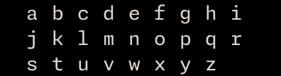
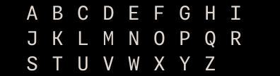
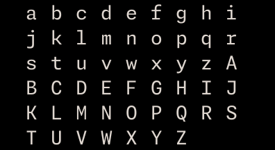
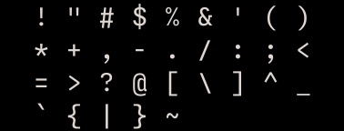
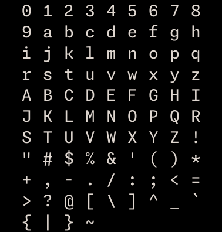

# char 库

## 基本库说明

`char` 提供常用的字符集常量。

---

## 目录

### 常量

| 常量名               | 说明               | 索引                                  |
| ----------------- | ---------------- | ----------------------------------- |
| `LINE`            | 单线边框字符表          | [LINE](#LINE)                       |
| `BOLD_LINE`       | 粗线边框字符表          | [BOLD_LINE](#BOLD_LINE)             |
| `DOUBLE_LINE`     | 双线边框字符表          | [DOUBLE_LINE](#DOUBLE_LINE)         |
| `ROUNDED_LINE`    | 圆角线边框字符表         | [ROUNDED_LINE](#ROUNDED_LINE)       |
| `ASCII_NUMBER`    | `"0"`~`"9"` 字符数组 | [ASCII_NUMBER](#ASCII_NUMBER)       |
| `ASCII_LOWERCASE` | `"a"`~`"z"` 字符数组 | [ASCII_LOWERCASE](#ASCII_LOWERCASE) |
| `ASCII_UPPERCASE` | `"A"`~`"Z"` 字符数组 | [ASCII_UPPERCASE](#ASCII_UPPERCASE) |
| `ASCII_LETTER`    | 大小写字母字符数组        | [ASCII_LETTER](#ASCII_LETTER)       |
| `ASCII_CHARACTER` | ASCII 符号字符数组     | [ASCII_CHARACTER](#ASCII_CHARACTER) |
| `ASCII`           | 数字+字母+符号全量字符数组   | [ASCII](#ASCII)                     |

---

## 常量

## `LINE`

单线边框字符表。

**可用于**

- `border_char` 参数

### 调用

```lua
char.LINE
```

### 字段

| 字段             | 字符  | 说明   |
| -------------- | --- | ---- |
| `top`          | `─` | 上边框  |
| `left_top`     | `┌` | 左上角  |
| `left`         | `│` | 左边框  |
| `left_bottom`  | `└` | 左下角  |
| `bottom`       | `─` | 下边框  |
| `right_bottom` | `┘` | 右下角  |
| `right`        | `│` | 右边框  |
| `right_top`    | `┐` | 右上角  |
| `t_left`       | `├` | 左侧连接 |
| `t_bottom`     | `┴` | 下侧连接 |
| `t_right`      | `┤` | 右侧连接 |
| `t_top`        | `┬` | 上侧连接 |
| `center`       | `┼` | 中心连接 |
### 示例

```lua
draw.stroke_rect {
	x = 15,
	y = 1,
	width = 12,
	height = 5,
	border_char = char.LINE
}
```

输出：


---

## `BOLD_LINE`

粗线边框字符表。

**可用于**

- `border_char` 参数

### 调用

```lua
char.BOLD_LINE
```

### 字段

| 字段             | 字符  | 说明   |
| -------------- | --- | ---- |
| `top`          | `━` | 上边框  |
| `left_top`     | `┏` | 左上角  |
| `left`         | `┃` | 左边框  |
| `left_bottom`  | `┗` | 左下角  |
| `bottom`       | `━` | 下边框  |
| `right_bottom` | `┛` | 右下角  |
| `right`        | `┃` | 右边框  |
| `right_top`    | `┓` | 右上角  |
| `t_left`       | `┣` | 左侧连接 |
| `t_bottom`     | `┻` | 下侧连接 |
| `t_right`      | `┫` | 右侧连接 |
| `t_top`        | `┳` | 上侧连接 |
| `center`       | `╋` | 中心连接 |
### 示例

```lua
draw.stroke_rect {
	x = 15,
	y = 1,
	width = 12,
	height = 5,
	border_char = char.BOLD_LINE
}
```

输出：


---

## `DOUBLE_LINE`

双线边框字符表。

**可用于**

- `border_char` 参数

### 调用

```lua
char.DOUBLE_LINE
```

### 字段

| 字段             | 字符  | 说明   |
| -------------- | --- | ---- |
| `top`          | `═` | 上边框  |
| `left_top`     | `╔` | 左上角  |
| `left`         | `║` | 左边框  |
| `left_bottom`  | `╚` | 左下角  |
| `bottom`       | `═` | 下边框  |
| `right_bottom` | `╝` | 右下角  |
| `right`        | `║` | 右边框  |
| `right_top`    | `╗` | 右上角  |
| `t_left`       | `╠` | 左侧连接 |
| `t_bottom`     | `╩` | 下侧连接 |
| `t_right`      | `╣` | 右侧连接 |
| `t_top`        | `╦` | 上侧连接 |
| `center`       | `╬` | 中心连接 |
### 示例

```lua
draw.stroke_rect {
	x = 15,
	y = 1,
	width = 12,
	height = 5,
	border_char = char.DOUBLE_LINE
}
```

输出：


---

## `ROUNDED_LINE`

圆角线边框字符表。

**可用于**

- `border_char` 参数

### 调用

```lua
char.ROUNDED_LINE
```

### 字段

| 字段             | 字符  | 说明   |
| -------------- | --- | ---- |
| `top`          | `─` | 上边框  |
| `left_top`     | `╭` | 左上角  |
| `left`         | `│` | 左边框  |
| `left_bottom`  | `╰` | 左下角  |
| `bottom`       | `─` | 下边框  |
| `right_bottom` | `╯` | 右下角  |
| `right`        | `│` | 右边框  |
| `right_top`    | `╮` | 右上角  |
| `t_left`       | `├` | 左侧连接 |
| `t_bottom`     | `┴` | 下侧连接 |
| `t_right`      | `┤` | 右侧连接 |
| `t_top`        | `┬` | 上侧连接 |
| `center`       | `┼` | 中心连接 |
### 示例

```lua
draw.stroke_rect {
	x = 15,
	y = 1,
	width = 12,
	height = 5,
	border_char = char.ROUNDED_LINE
}
```

输出：


---

## `ASCII_NUMBER`

数字字符数组。

**可用于**

- 任意

### 调用

```lua
char.ASCII_NUMBER
```

### 字段

| 索引  | 字符  |
| --- | --- |
| 1   | `0` |
| 2   | `1` |
| 3   | `2` |
| 4   | `3` |
| 5   | `4` |
| 6   | `5` |
| 7   | `6` |
| 8   | `7` |
| 9   | `8` |
| 10  | `9` |
### 示例

```lua
local x = 0

for item in ipairs(char.ASCII_NUMBER) do
	x = x + 2
	draw.text { x = x, y = y, text = item.value }
end
```

输出：


### 额外补充

- 所有数字均为**字符串**类型，而非数字。

---

## `ASCII_LOWERCASE`

小写字母字符数组。

**可用于**

- 任意

### 调用

```lua
char.ASCII_LOWERCASE
```

### 字段

| 索引   | 字符 | 说明     |
| ---- | --- | ------ |
| 1    | `a` | 小写字母 a |
| 2    | `b` | 小写字母 b |
| ...  | ... | ...    |
| 26   | `z` | 小写字母 z |
### 示例

```lua
local x = 0
local y = 0

for item in ipairs(char.ASCII_LOWERCASE) do
	x = x + 2
	if x % 20 == 0 then
		x = 2
		y = y + 1
	end
	draw.text { x = x, y = y, text = item.value }
end
```

输出：



---

## `ASCII_UPPERCASE`

大写字母字符数组。

**可用于**

- 任意

### 调用

```lua
char.ASCII_UPPERCASE
```

### 字段

| 索引   | 字符 | 说明     |
| ---- | --- | ------ |
| 1    | `A` | 大写字母 A |
| 2    | `B` | 大写字母 B |
| ...  | ... | ...    |
| 26   | `Z` | 大写字母 Z |
### 示例

```lua
local x = 0
local y = 0

for item in ipairs(char.ASCII_UPPERCASE) do
	x = x + 2
	if x % 20 == 0 then
		x = 2
		y = y + 1
	end
	draw.text { x = x, y = y, text = item.value }
end
```

输出：



---

## `ASCII_LETTER`

全部大小写字母字符数组。

**可用于**

- 任意

### 调用

```lua
char.ASCII_LETTER
```

### 字段

| 索引   | 字符 | 说明       |
| ---- | --- | -------- |
| 1    | `a` | 小写字母 a   |
| 2    | `b` | 小写字母 b   |
| ...  | ... | ...      |
| 26   | `z` | 小写字母 z   |
| 27   | `A` | 大写字母 A   |
| 28   | `B` | 大写字母 B   |
| ...  | ... | ...      |
| 52   | `Z` | 大写字母 Z   |
### 示例

```lua
local x = 0
local y = 0

for item in ipairs(char.ASCII_LETTER) do
	x = x + 2
	if x % 20 == 0 then
		x = 2
		y = y + 1
	end
	draw.text { x = x, y = y, text = item.value }
end
```

输出：



---

## `ASCII_CHARACTER`

ASCII 符号字符数组。

**可用于**

- 任意

### 调用

```lua
char.ASCII_CHARACTER
```

### 字段

| 索引  | 字符      | 说明  |
| --- | ------- | --- |
| 1   | `!`     | 符号  |
| 2   | `"`     | 符号  |
| 3   | `#`     | 符号  |
| 4   | `$`     | 符号  |
| 5   | `%`     | 符号  |
| 6   | `&`     | 符号  |
| 7   | `'`     | 符号  |
| 8   | `(`     | 符号  |
| 9   | `)`     | 符号  |
| 10  | `*`     | 符号  |
| 11  | `+`     | 符号  |
| 12  | `,`     | 符号  |
| 13  | `-`     | 符号  |
| 14  | `.`     | 符号  |
| 15  | `/`     | 符号  |
| 16  | `:`     | 符号  |
| 17  | `;`     | 符号  |
| 18  | `<`     | 符号  |
| 19  | `=`     | 符号  |
| 20  | `>`     | 符号  |
| 21  | `?`     | 符号  |
| 22  | `@`     | 符号  |
| 23  | `[`     | 符号  |
| 24  | `\`     | 符号  |
| 25  | `]`     | 符号  |
| 26  | `^`     | 符号  |
| 27  | `_`     | 符号  |
| 28  | `` ` `` | 符号  |
| 29  | `{`     | 符号  |
| 30  | `\|`    | 符号  |
| 31  | `}`     | 符号  |
| 32  | `~`     | 符号  |
### 示例

```lua
draw.stroke_rect {
	x = 15,
	y = 1,
	width = 12,
	height = 5,
	border_char = char.ROUNDED_LINE
}
```

输出：



---

## `ASCII`

全量可打印 ASCII 字符数组。

**可用于**

- 任意

### 调用

```lua
char.ASCII
```

### 字段

| 索引   | 字符 | 说明 |
| ---- | --- | -- |
| 1    | `0` | 数字 |
| 2    | `1` | 数字 |
| ...  | ... | ... |
| 10   | `9` | 数字 |
| 11   | `a` | 小写字母 |
| ...  | ... | ... |
| 36   | `z` | 小写字母 |
| 37   | `A` | 大写字母 |
| ...  | ... | ... |
| 62   | `Z` | 大写字母 |
| 63   | `!` | 符号 |
| ...  | ... | ... |
| 94   | `~` | 符号 |
### 示例

```lua
draw.stroke_rect {
	x = 15,
	y = 1,
	width = 12,
	height = 5,
	border_char = char.ROUNDED_LINE
}
```

输出：


